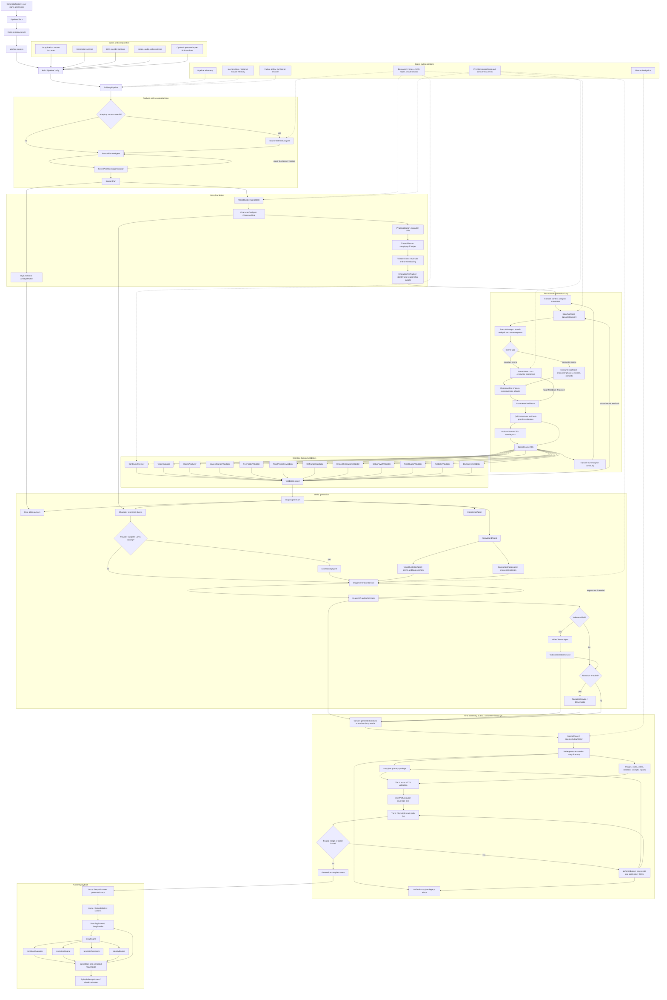

# StoryRPG Pipeline Mermaid Chart

**Last Updated:** May 2026

This diagram shows the end-to-end StoryRPG generation pipeline, from the Generator UI through the proxy worker, multi-agent story generation, media generation, QA, output writing, and playback.

