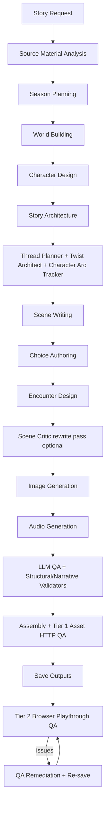

# StoryRPG - Technical Design Document

**Version:** 3.1 (Comprehensive Reference Edition)  
**Last Updated:** May 25, 2026
**Status:** Active Development

Read `docs/PROJECT_STATUS.md` first for the current implementation snapshot.
This TDD is the deeper technical reference; older architecture descriptions in
this file should be interpreted through the reader/generator split and pipeline
status documented there.

---

## Table of Contents

1. [System Overview](#1-system-overview)
2. [Technology Stack](#2-technology-stack)
3. [Architecture: Three Execution Zones](#3-architecture-three-execution-zones)
4. [Directory Structure](#4-directory-structure)
5. [Application Runtime (Client)](#5-application-runtime-client)
6. [Story Playback Engine](#6-story-playback-engine)
7. [Canonical Data Model](#7-canonical-data-model)
8. [State Management](#8-state-management)
9. [Proxy Server (Control Plane)](#9-proxy-server-control-plane)
10. [AI Agent Pipeline](#10-ai-agent-pipeline)
11. [Pipeline Orchestration Deep Dive](#11-pipeline-orchestration-deep-dive)
12. [Worker System](#12-worker-system)
13. [Validation Architecture](#13-validation-architecture)
14. [Image Generation System](#14-image-generation-system)
15. [Audio Generation System](#15-audio-generation-system)
16. [Resolution Engine](#16-resolution-engine)
17. [Identity Engine](#17-identity-engine)
18. [Condition Evaluator](#18-condition-evaluator)
19. [Template Processor](#19-template-processor)
20. [Persistence and Storage](#20-persistence-and-storage)
21. [Event and Telemetry System](#21-event-and-telemetry-system)
22. [Configuration System](#22-configuration-system)
23. [Error Handling and Recovery](#23-error-handling-and-recovery)
24. [Security and API Key Management](#24-security-and-api-key-management)
25. [Build and Deployment](#25-build-and-deployment)
26. [Constraints and Known Limitations](#26-constraints-and-known-limitations)

---

## 1) System Overview

StoryRPG is a local-first interactive fiction application built with React Native/Expo, backed by a Node.js/Express proxy server, and powered by a TypeScript AI agent generation pipeline. The system generates, validates, and plays back branching interactive stories with images, optional video, and optional audio narration.

The app now has two target-specific web entries in one package:

- **Reader** (`apps/reader/ReaderApp.tsx`) is the public playback target.
- **Generator** (`apps/generator/GeneratorApp.tsx`) is the internal creation/operator target.

The old monolithic `App.tsx` shell has been removed. `STORYRPG_APP_TARGET`
selects the Reader or Generator target used by Metro and Expo config.

The architecture is designed around three core requirements:

1. **Long-running generation jobs** that may take 15-60+ minutes must survive failures, browser refreshes, and network interruptions.
2. **Fiction-first playback** must be smooth, responsive, and completely divorced from the generation complexity.
3. **Multiple AI providers** (Anthropic Claude for text, Gemini/Midjourney/Atlas Cloud for images, ElevenLabs for audio) must be abstracted behind consistent interfaces.

### High-Level Data Flow

```
[User Input] → [Proxy Server] → [Worker Process] → [AI Pipeline]
                                                        ↓
[Generated Story Files] ← [Pipeline Output Writer] ← [Validated Story]
        ↓
[Client App] → [Story Engine] → [Player Experience]
```

The user starts generation from the client app. The client calls the proxy server, which spawns a worker process. The worker executes the AI pipeline, which calls LLM APIs (Anthropic, OpenAI, Gemini), image generation APIs, and audio APIs. The pipeline validates and writes the resulting story to the filesystem. The client then reads the story files and plays them back through the story engine.

---

## 2) Technology Stack

### Frontend (Client Runtime)

| Technology | Version | Purpose |
|---|---|---|
| React | 19.1.0 | UI component framework |
| React Native | 0.81.5 | Cross-platform mobile framework |
| Expo | ~54.0.31 | React Native build tooling and dev server |
| React Native Web | ^0.21.0 | Web platform support for React Native components |
| Zustand | ^5.0.10 | Lightweight state management for navigation, jobs, and generator state |
| AsyncStorage | ^2.2.0 | Client-side persistent key-value store |
| Lucide React Native | ^0.563.0 | Icon library |
| pdfjs-dist | ^3.11.174 | PDF parsing for source material upload |
| posthog-js | ^1.372.6 | Optional web analytics |

### Backend (Proxy/Control Plane)

| Technology | Version | Purpose |
|---|---|---|
| Node.js | 20.x | Server runtime |
| Express | ^5.2.1 | HTTP server framework |
| cors | ^2.8.5 | Cross-origin request handling |
| dotenv | ^17.2.3 | Environment variable loading |
| sharp | ^0.34.5 | Server-side image processing |
| pg | ^8.21.0 | Optional Postgres auth/session persistence |
| passport + strategies | various | Local, Google, and Discord-style OAuth |
| @google-cloud/storage | ^7.17.0 | Optional GCS-backed story storage |

### Build and Development

| Technology | Version | Purpose |
|---|---|---|
| TypeScript | ~5.9.2 | Type-safe JavaScript |
| ts-node | ^10.9.2 | TypeScript execution for worker processes |
| tsconfig-paths | ^4.2.0 | Path alias resolution |
| babel-preset-expo | ^54.0.9 | Babel compilation for Expo |
| Metro | (bundled with Expo) | JavaScript bundler |
| Vitest | ^4.0.18 | Unit testing (Node env with RN stubs) |
| Playwright | ^1.59.1 | End-to-end browser tests and Tier 2 in-pipeline story QA |

### External APIs

| Service | Purpose | Required? |
|---|---|---|
| Anthropic (Claude) | Primary LLM for text generation | Yes (for generation) |
| Google Gemini | Image generation (Nano-Banana provider) and optional Veo video | Optional (default image provider) |
| OpenAI | Optional text provider and GPT Image provider | Optional |
| Atlas Cloud | Alternative image generation | Optional |
| MidAPI (Midjourney) | Premium image generation | Optional |
| Stable Diffusion A1111/Forge | Self-hosted image generation | Optional |
| kohya sidecar | Stable Diffusion LoRA auto-training | Optional |
| ElevenLabs | Voice narration and text-to-speech | Optional |
| catbox.moe | Public hosting for reference images (MidAPI requirement) | Only with MidAPI |

---

## 3) Architecture: Three Execution Zones

The system is partitioned into three execution zones that communicate through well-defined interfaces:

### Zone 1: Client Runtime

**What it is:** The React Native/Expo application that runs in the user's browser (web) or on their phone (iOS/Android). On web, the current implementation is split into Reader and Generator targets selected by `STORYRPG_APP_TARGET`.

**What it does:**
- Displays the story catalog and lets users select stories
- Plays back stories through the reading interface
- Provides generation configuration and monitoring UI in the Generator target
- Manages player state (game progress, settings, identity)
- Polls the proxy for generation job updates in the Generator target

**What it does NOT do:**
- It does not call LLM APIs directly (all API calls go through the proxy)
- It does not write files to the filesystem (file writes go through proxy endpoints)
- The Reader target does not execute or import generation pipeline code. The Generator target imports the pipeline client/config surface but long-running work still runs in worker processes.

### Zone 2: Proxy/Control Plane

**What it is:** A Node.js/Express server running on `localhost:3001`.

**What it does:**
- Proxies all external API calls (Anthropic, ElevenLabs, MidAPI, Atlas Cloud) to avoid CORS restrictions and centralize error handling
- Manages the lifecycle of worker processes (start, monitor, cancel, clean up)
- Provides a filesystem API for reading/writing generated story files
- Maintains durable job state (generation jobs, worker checkpoints, dead letter queue)
- Serves generated images and audio files as static assets
- Persists generator settings, style anchors, reference images, image feedback, auth sessions, and optional Postgres-backed user records
- Redirects generated-story assets to GCS when `STORY_STORAGE_MODE=gcs`

**Key characteristic:** This is the "durability boundary" — if the client crashes or refreshes, the proxy still knows the state of all running jobs and can resume communication when the client reconnects.

### Zone 3: Pipeline Runtime

**What it is:** TypeScript code executed in child processes (workers) spawned by the proxy server.

**What it does:**
- Runs the full AI generation pipeline (world building, character design, story architecture, scene writing, etc.)
- Makes LLM API calls to Anthropic Claude (or OpenAI/Gemini)
- Makes image generation API calls
- Makes audio generation API calls
- Validates generated content
- Writes output artifacts (story JSON files, images, audio)

**Key characteristic:** Workers run as separate Node.js processes. They communicate with the proxy through structured events written to stdout, which the proxy captures and projects into its job tracking system.

### Communication Between Zones

```
Client ←→ Proxy:      HTTP REST endpoints + polling
Proxy  ←→ Worker:     Child process stdio (stdout events, stdin commands)
Worker ←→ AI APIs:    HTTPS calls (proxied through the proxy server for LLM,
                       direct for some image/audio services)
Proxy  ←→ Filesystem: Direct file I/O (JSON files, images, audio)
Client ←→ Filesystem: Via proxy HTTP endpoints only
```

---

## 4) Directory Structure

Current layout notes:

- The workspace root in this fork is `StoryRPG_fork/`, though many historical
  docs and examples still refer to `StoryRPG_New/`.
- `storyrpg-prototype/apps/reader/ReaderApp.tsx` and
  `storyrpg-prototype/apps/generator/GeneratorApp.tsx` are the current web
  target entries.
- The old monolithic `App.tsx` shell has been removed.
- `src/story-codec/` is the reader/runtime package codec. `src/ai-agents/codec/`
  contains pipeline-side codec/event helpers.
- `src/types/index.ts` is now a barrel over topic-oriented type modules rather
  than a single monolithic type file.
- Proxy routes include auth, GCS-aware catalog serving, generated story
  mutation, style anchors, image feedback, model scanning, Stable Diffusion,
  LoRA trainer forwarding, and worker lifecycle routes.

```
StoryRPG_New/
├── AGENTS.md                           # Agent orientation (workspace rule)
├── docs/                               # All project documentation
│   ├── GDD.md                          # Game Design Document
│   ├── TDD.md                          # Technical Design Document (this file)
│   ├── CURRENT_PIPELINE_STATUS.md      # Current pipeline and compatibility status
│   ├── INSTALL.md                      # Installation Guide
│   ├── IMAGE_PIPELINE_RUNTIME.md       # Image generation pipeline docs
│   ├── INCREMENTAL_VALIDATION_PLAN.md  # Validation system docs
│   ├── MOBILE_REDESIGN.md              # Mobile UX design docs
│   ├── PARALLEL_GENERATION.md          # Parallel processing docs
│   ├── QA_FIXES_SUMMARY.md             # Quality assurance improvements
│   ├── STORY_AGENT_SYSTEM_DETAIL.md    # Agent system details
│   ├── STORY_BRANCHING.md              # Branching story design
│   ├── STORY_PIPELINE_MERMAID.md       # Story pipeline diagrams
│   ├── STORY_PIPELINE_PROMPTING.md     # LLM prompting strategies
│   ├── STORY_QUALITY_CONTRACT.md       # Story quality rules and validator contract
│   ├── sample-story.md                 # Sample story reference
│   ├── visual_storytelling_guide.md    # Visual direction reference
│   ├── visual_storytelling_quick_reference.md
│   └── reference/                      # Original reference materials
│
└── storyrpg-prototype/                 # Main application directory
    ├── apps/
    │   ├── reader/ReaderApp.tsx        # Public Reader target entry
    │   └── generator/GeneratorApp.tsx  # Internal Generator target entry
    ├── index.ts                        # Expo app registration + polyfills
    ├── proxy-server.js                 # Express proxy server bootstrap
    ├── package.json                    # Dependencies and scripts
    ├── tsconfig.json                   # TypeScript config (client)
    ├── tsconfig.worker.json            # TypeScript config (worker processes)
    ├── tsconfig.app.json               # App-specific TypeScript config
    ├── tsconfig.test.json              # Test-specific TypeScript config
    ├── tsconfig.contracts.json         # Contract validation TypeScript config
    ├── babel.config.js                 # Babel config with path aliases
    ├── metro.config.js                 # Metro bundler config
    ├── app.json                        # Expo app configuration
    ├── docker-compose.proxy.yml        # Docker config for proxy server
    ├── .env                            # Environment variables (API keys)
    │
    ├── scripts/                        # Build and utility scripts
    │   ├── clean-runtime-artifacts.mjs # Cleanup script
    │   ├── upload-stories-to-blob.ts   # Upload story outputs to Vercel Blob
    │   └── validate-assets.ts          # Standalone asset HTTP verifier (Tier 1 QA CLI)
    │
    ├── test/
    │   ├── e2e/
    │   │   └── storyPlaythrough.spec.ts # Playwright browser playthrough test (Tier 2 QA)
    │   └── stubs/                      # Vitest stubs for react-native and async-storage
    │
    ├── playwright.config.ts            # Playwright config (port 8081, chromium, 5 min timeouts)
    │
    ├── proxy/                          # Proxy server modules
    │   ├── authRoutes.js               # Passport/local/OAuth session routes
    │   ├── authUserStore.js            # Auth user persistence helper
    │   ├── cachedJsonStore.js
    │   ├── catalogRoutes.js
    │   ├── db/pool.js                  # Optional Postgres pool
    │   ├── fileRoutes.js
    │   ├── gcsConfig.js                # GCS storage-mode helpers
    │   ├── generatorSettingsRoutes.js  # Persist/restore full generator UI settings
    │   ├── imageFeedbackRoutes.js      # Image feedback persistence
    │   ├── loraTrainingRoutes.js       # LoRA trainer sidecar forwarding
    │   ├── modelScanRoutes.js          # Discover available LLM/image models (24h cache)
    │   ├── refImageRoutes.js
    │   ├── runtimePaths.js             # Local/ephemeral runtime path layout
    │   ├── stableDiffusionRoutes.js    # A1111/Forge proxy route
    │   ├── storyCatalog.js
    │   ├── storyCodec.js
    │   ├── storyManifest.js
    │   ├── storyMutationRoutes.js
    │   ├── styleRoutes.js              # Style-bible anchor persistence
    │   ├── workerLifecycle.js          # Worker spawn/state/checkpoint lifecycle
    │   ├── workerJobSync.js
    │   └── workerProgress.js
    │
    ├── src/
    │   ├── ai-agents/                  # AI Generation Pipeline (~97 files)
    │   │   ├── agents/                 # Individual AI agent classes
    │   │   │   ├── BaseAgent.ts        # Abstract base class for all agents
    │   │   │   ├── StoryArchitect.ts   # Episode blueprint design
    │   │   │   ├── WorldBuilder.ts     # World bible generation
    │   │   │   ├── CharacterDesigner.ts # NPC profile generation
    │   │   │   ├── SceneWriter.ts      # Beat/prose generation (absorbs old BeatWriter/DialogueSpecialist/ScriptCompiler/ResolutionDesigner)
    │   │   │   ├── ChoiceAuthor.ts     # Choice generation with consequences
    │   │   │   ├── EncounterArchitect.ts # Encounter design
    │   │   │   ├── BranchManager.ts    # Branch/reconvergence management
    │   │   │   ├── QAAgents.ts         # LLM QA agents (continuity, voice, stakes, pacing, tone, sensitivity)
    │   │   │   ├── SceneCritic.ts      # Optional Phase-9 subtext/reversals rewrite pass
    │   │   │   ├── StyleArchitect.ts   # Expands free-form art style strings into ArtStyleProfile
    │   │   │   ├── ThreadPlanner.ts    # Authors the NarrativeThread ledger for setup/payoff tracking
    │   │   │   ├── TwistArchitect.ts   # Schedules per-episode reversal + foreshadow
    │   │   │   ├── CharacterArcTracker.ts # Per-episode identity/relationship milestone targets
    │   │   │   ├── SeasonPlannerAgent.ts # Season planning (Story Circle spine)
    │   │   │   ├── SourceMaterialAnalyzer.ts # Source analysis (anchors, Story Circle, episode breakdown)
    │   │   │   └── image-team/         # Image generation agents (see below)
    │   │   │
    │   │   ├── pipeline/               # Pipeline orchestrators
    │   │   │   ├── FullStoryPipeline.ts # Main pipeline coordinator
    │   │   │   ├── PipelineClient.ts   # Typed client the UI uses to drive the pipeline over the proxy
    │   │   │   ├── checkpointing.ts    # Extracted checkpoint writer/loader
    │   │   │   ├── events.ts           # Typed pipeline progress events
    │   │   │   ├── callbackLedger.ts   # Callback hook ledger for delayed consequence payoffs
    │   │   │   ├── choiceMemoryDebt.ts # Shared callback/residue evidence + classification helpers
    │   │   │   ├── residueObligations.ts # Planned residue fulfillment before assembly/QA
    │   │   │   └── phases/             # Phase-specific logic (WorldBuildingPhase, SavingPhase, …)
    │   │   │
    │   │   ├── codec/                  # Pipeline-side codec/event helpers
    │   │   │   ├── storyCodec.ts       # Encode/decode + version tag
    │   │   │   ├── storyManifest.ts    # Asset manifest per story
    │   │   │   ├── assetIndex.ts       # Asset index helper
    │   │   │   └── workerEvent.ts      # Worker event codec
    │   │   │
    │   │   ├── images/                 # Art direction and provider plumbing
    │   │   │   ├── artStyleProfile.ts  # ArtStyleProfile interface + heuristics (`buildVerbatimProfile`, `composeCanonicalStyleString`)
    │   │   │   ├── cinematicPromptCore.ts # Shared cinematic prompt builder consumed by every image phase
    │   │   │   ├── anchorPrompts.ts    # Style-bible anchors (character / arc color / environment)
    │   │   │   ├── providerCapabilities.ts # Per-provider capability matrix (LoRA, references, video, …)
    │   │   │   ├── referenceStrategy.ts # Selects which reference images each provider should receive
    │   │   │   ├── datasetBuilder.ts   # Turn reference sheets + anchors into captioned LoRA training sets
    │   │   │   └── loraRegistry.ts     # Fingerprint-keyed LoRA cache in generated-stories/<storyId>/loras/
    │   │   │
    │   │   ├── services/               # External service integrations
    │   │   │   ├── imageGenerationService.ts  # Multi-provider image service
    │   │   │   ├── providerThrottle.ts        # Per-provider concurrency + RPM throttling
    │   │   │   ├── providers/                 # ImageProviderAdapter + Atlas/Gemini/MidAPI/SD/placeholder adapters
    │   │   │   ├── stable-diffusion/          # A1111/Forge adapter, buildSDPrompt, seed registry, reference-pack adapter
    │   │   │   ├── lora-training/             # LoraTrainerAdapter, KohyaAdapter, factory
    │   │   │   ├── audioGenerationService.ts  # ElevenLabs audio service
    │   │   │   ├── voiceCastingService.ts     # ElevenLabs voice casting
    │   │   │   └── videoGenerationService.ts  # Video generation service
    │   │   │
    │   │   ├── validators/             # Content validation
    │   │   │   ├── StructuralValidator.ts
    │   │   │   ├── IntegratedBestPracticesValidator.ts
    │   │   │   ├── IncrementalValidators.ts      # Per-scene voice/stakes/continuity/sensitivity/encounter
    │   │   │   ├── BaseValidator.ts
    │   │   │   ├── PhaseValidator.ts             # Structural validation per pipeline phase (e.g. CharacterBible)
    │   │   │   ├── SeasonValidator.ts            # Full-season structural pass
    │   │   │   ├── StoryCircleCoverageValidator.ts # Story Circle coverage gate
    │   │   │   ├── CallbackOpportunitiesValidator.ts
    │   │   │   ├── CallbackCoverageValidator.ts
    │   │   │   ├── SetupPayoffValidator.ts       # NarrativeThread Chekhov's-gun coverage
    │   │   │   ├── TwistQualityValidator.ts     # Foreshadow-precedes-reveal per episode
    │   │   │   ├── ArcDeltaValidator.ts         # Start-vs-end identity/relationship deltas
    │   │   │   ├── DivergenceValidator.ts       # Cosmetic-branching detector
    │   │   │   ├── pathSimulator.ts             # Lightweight choice-path simulator used by DivergenceValidator
    │   │   │   ├── PixarPrinciplesValidator.ts  # Stakes triangle + surprise checks
    │   │   │   ├── StakesTriangleValidator.ts
    │   │   │   ├── ChoiceDensityValidator.ts
    │   │   │   ├── ChoiceDistributionValidator.ts
    │   │   │   ├── CliffhangerValidator.ts
    │   │   │   ├── ConsequenceBudgetValidator.ts
    │   │   │   ├── NPCDepthValidator.ts
    │   │   │   ├── FiveFactorValidator.ts
    │   │   │   ├── storyAssetWalker.ts           # Tier 1 QA: HTTP-verify every image URL
    │   │   │   ├── storyPathAnalyzer.ts          # Coverage planner for multi-path browser runs
    │   │   │   ├── playwrightQARunner.ts         # Tier 2 QA: spawn Playwright, parse results
    │   │   │   └── qaRemediation.ts              # Auto-fix broken images flagged by Tier 2
    │   │   │
    │   │   ├── agents/image-team/       # Image generation agents
    │   │   │   ├── ImageAgentTeam.ts    # Orchestrator for character / storyboard / illustration / encounter / LoRA phases
    │   │   │   ├── CharacterReferenceSheetAgent.ts
    │   │   │   ├── StoryboardAgent.ts
    │   │   │   ├── VisualIllustratorAgent.ts
    │   │   │   ├── EncounterImageAgent.ts
    │   │   │   ├── VideoDirectorAgent.ts
    │   │   │   ├── LoraTrainingAgent.ts         # Orchestrates auto-train-LoRA (SD only)
    │   │   │   ├── VisualQualityJudge.ts        # Replaces VisualNarrativeValidator + DramaExtractionAgent
    │   │   │   ├── visualChecks/                # Modular visual checks (CompositionCheck, …)
    │   │   │   ├── coordinators/                # Shared coordination helpers
    │   │   │   ├── CinematicBeatAnalyzer.ts
    │   │   │   ├── ColorScriptAgent.ts
    │   │   │   ├── LightingColorSystem.ts, LightingColorValidator.ts
    │   │   │   ├── CompositionValidatorAgent.ts, ConsistencyScorerAgent.ts
    │   │   │   ├── BodyLanguageValidator.ts, ExpressionValidator.ts, PoseDiversityValidator.ts
    │   │   │   ├── TransitionValidator.ts
    │   │   │   ├── VisualNarrativeSystem.ts, VisualStorytellingSystem.ts, VisualStorytellingValidator.ts
    │   │   │   └── CharacterActionLibrary.ts
    │   │   │
    │   │   ├── converters/             # Data format converters
    │   │   ├── prompts/                # LLM prompt templates
    │   │   ├── utils/                  # Pipeline utilities
    │   │   │   ├── pipelineOutputWriter.ts  # File output management
    │   │   │   ├── llmParsing.ts       # LLM response parsing
    │   │   │   ├── concurrency.ts      # Concurrency management
    │   │   │   └── memoryStore.ts      # Memory management
    │   │   │
    │   │   ├── server/                 # Server-side execution
    │   │   │   └── worker-runner.ts    # Worker process entry point
    │   │   │
    │   │   ├── config.ts              # Pipeline configuration
    │   │   └── types/                  # Pipeline-specific types
    │   │
    │   ├── screens/                    # Shared application screens
    │   │   ├── HomeScreen.tsx          # Story catalog
    │   │   ├── EpisodeSelectScreen.tsx # Episode chooser
    │   │   ├── ReadingScreen.tsx       # Story playback
    │   │   ├── GeneratorScreen.tsx     # Generation workflow
    │   │   ├── SettingsScreen.tsx      # Preferences and management
    │   │   ├── VisualizerScreen.tsx    # Story graph visualization
    │   │   ├── reader/                 # Reader-only settings composition
    │   │   └── generator/              # Generation screen components, steps, hooks
    │   │
    │   ├── components/                 # Reusable UI components
    │   │   ├── StoryReader.tsx         # Core reading interface (~2000 lines)
    │   │   ├── ReadingShell.tsx        # Shared reader chrome (header, choices, continue)
    │   │   ├── EncounterView.tsx       # Encounter playback
    │   │   ├── ChoiceButton.tsx        # Choice rendering
    │   │   ├── ContinueButton.tsx      # Canonical CONTINUE / CONCLUDE ENCOUNTER button
    │   │   ├── ModelDropdown.tsx       # Provider+model selection (uses useAvailableModels)
    │   │   ├── NarrativeText.tsx       # Text display with formatting
    │   │   ├── PipelineProgress.tsx    # Generation progress UI
    │   │   ├── StoryBrowser.tsx        # Story catalog browser
    │   │   ├── ui/                     # Shared primitives (design system)
    │   │   │   ├── ScreenHeader.tsx        # Eyebrow + title + back button
    │   │   │   ├── SectionCard.tsx         # Bordered card with header/description
    │   │   │   ├── SegmentedControl.tsx    # Segmented value picker
    │   │   │   ├── Toggle.tsx              # Animated switch with helper text
    │   │   │   └── ConfirmDialog.tsx       # Modal confirm dialog
    │   │   └── settings/               # Settings screen building blocks
    │   │       ├── SettingsSections.tsx    # Section components (display, jobs, library, ...)
    │   │       └── SettingsModals.tsx      # Cancel/delete/rename modals
    │   │
    │   ├── stores/                     # State management
    │   │   ├── gameStore.ts            # Player/game state (React Context)
    │   │   ├── settingsStore.ts        # User settings (React Context)
    │   │   ├── generationJobStore.ts   # Generation jobs (Zustand)
    │   │   ├── seasonPlanStore.ts      # Season plans (module store)
    │   │   ├── imageJobStore.ts        # Image job tracking
    │   │   ├── imageFeedbackStore.ts   # Image quality feedback
    │   │   ├── videoJobStore.ts        # Video job tracking
    │   │   ├── appNavigationStore.ts   # Navigation state
    │   │   ├── encounterStatePersistence.ts # Encounter persistence
    │   │   └── playerStatePersistence.ts # Player state persistence
    │   │
    │   ├── engine/                     # Game logic engine
    │   │   ├── storyEngine.ts          # Beat processing, choice filtering, routing
    │   │   ├── resolutionEngine.ts     # Fiction-first stat check resolution
    │   │   ├── identityEngine.ts       # Identity profile management
    │   │   ├── conditionEvaluator.ts   # Condition tree evaluation
    │   │   ├── templateProcessor.ts    # Text template variable substitution
    │   │   └── growthConsequenceBuilder.ts  # Builds growth/skill consequences for choices
    │   │
    │   ├── services/                   # Client-side services
    │   │   ├── analyticsService.ts     # Optional PostHog analytics wrapper
    │   │   ├── authSession.ts          # Proxy session fetch helpers
    │   │   ├── storyLibrary.ts         # Catalog/package loading + media resolution
    │   │   ├── narrationService.ts     # Audio narration playback
    │   │   └── encounterMemoryService.ts # Encounter state persistence
    │   ├── story-codec/                # Runtime reader story package codec
    │   ├── assets/                     # AssetRef and media URL resolver
    │   │
    │   ├── types/                      # Topic-oriented TypeScript type definitions
    │   │   ├── index.ts                # Barrel re-export for compatibility
    │   │   ├── seasonPlan.ts           # Season planning types
    │   │   ├── sourceAnalysis.ts       # Source analysis types
    │   │   └── validation.ts           # Validation types
    │   │
    │   ├── data/stories/               # Built-in story data
    │   │   ├── bladesOfValoria.ts
    │   │   ├── savageNightsInParadise.ts
    │   │   ├── shadowsOfRavenmoor.ts
    │   │   └── theVelvetJob.ts
    │   │
    │   ├── theme/                      # Visual theme constants
    │   │   ├── terminal.ts             # Terminal color palette and shared styles
    │   │   └── copy.ts                 # Canonical reader UI copy (CONTINUE, eyebrows, ...)
    │   ├── constants/                  # Application constants
    │   ├── config/                     # Runtime configuration
    │   │   ├── endpoints.ts            # API endpoint resolution
    │   │   ├── generatorLlmOptions.ts  # Generator-screen LLM model catalog
    │   │   └── version.ts              # App version label (auto-read from package.json)
    │   ├── hooks/                      # React hooks
    │   │   ├── useAvailableModels.ts   # Fetch & cache available LLM/image models
    │   │   └── useGeneratorSettings.ts # Load/save generator settings via proxy
    │   ├── visualizer/                 # Graph visualization components
    │   └── utils/                      # General utilities
    │
    ├── generated-stories/              # Output directory for generated stories
    │   └── {story-slug}_{timestamp}/   # Per-story output directory
    │       ├── story.json              # Primary versioned story package
    │       ├── manifest.json           # Primary-file pointer and package checksum
    │       ├── images/                 # Generated images
    │       ├── audio/                  # Generated audio files
    │       │   ├── {beatId}.mp3
    │       │   └── {beatId}.alignment.json
    │       └── prompts/                # Saved LLM prompts (debug)
    │
    ├── pipeline-memories/              # Pipeline memory storage
    ├── .ref-images/                    # Character reference images
    ├── .generation-jobs.json           # Persistent job tracking
    ├── .worker-jobs.json               # Worker job state
    ├── .worker-checkpoints.json        # Checkpoint data for resumability
    ├── .worker-dead-letter.json        # Failed job records
    └── .image-feedback.json            # User image quality feedback
```

---

## 5) Application Runtime (Client)

### Entry Point Flow

1. **`index.ts`** — Registers the root component with Expo. Applies Node.js polyfills (Buffer, process, crypto, stream) needed for some libraries to function in the browser/mobile environment.

2. **`@storyrpg/app-entry`** — Metro resolves this virtual entry to either `apps/reader/ReaderApp.tsx` or `apps/generator/GeneratorApp.tsx` based on `STORYRPG_APP_TARGET`.

3. **`apps/reader/ReaderApp.tsx`** — Public playback shell. Sets up game/settings providers, story library loading, reader navigation, player persistence, and reader analytics.

4. **`apps/generator/GeneratorApp.tsx`** — Internal creator shell. Sets up game/settings/generator providers, story library access, generator runner helpers, media continuation jobs, visualizer routing, and generator analytics.

5. **`App.tsx`** — Legacy monolithic shell retained in the repo. It still reflects many integration patterns but is no longer the cleanest deployment boundary.

### Provider Hierarchy

```
ErrorBoundary
  └── SettingsProvider / GeneratorSettingsProvider
      └── GameProvider
          └── Target-specific app content
```

Reader uses `SettingsProvider` and `GameProvider`. Generator uses those plus
`GeneratorSettingsProvider`. Zustand stores live outside the provider tree for
navigation and job state where module-level subscriptions are easier to manage.

### Navigation Model

The app uses state-based navigation rather than a URL router.

Reader keeps a local screen state:

```typescript
type ReaderScreen = 'home' | 'episodes' | 'reading' | 'settings';
```

Generator keeps a smaller internal route state for creator flows:

```typescript
type GeneratorRoute = 'home' | 'generator' | 'visualizer';
```

The legacy/monolithic shell and some shared navigation helpers still use
`appNavigationStore`:

```typescript
type Screen = 'home' | 'episodes' | 'reading' | 'settings' | 'visualizer' | 'generator';
```

Navigation handlers:
- `handleStartStory(storyId)` → loads story → navigates to `episodes`
- `handleSelectEpisode(episodeId)` → navigates to `reading`
- `handleOpenSettings()` → navigates to `settings`
- `handleOpenGenerator(resumeJobId?)` → navigates to `generator`
- `handleOpenVisualizer(storyId)` → navigates to `visualizer`

### Story Catalog Loading

On app start, the story catalog is assembled from three sources:

1. **Built-in stories:** Four pre-authored stories bundled in the app code (`src/data/stories/`). On web platform, these are installed as physical files on the proxy server if not already present.

2. **Generated stories:** The client calls `GET /list-stories` on the proxy server to discover stories in the `generated-stories/` directory. The catalog reads `manifest.json` first, then falls back to `story.json`; legacy-only directories must be migrated before runtime load.

3. **AsyncStorage cache:** A fallback for cases where the proxy is unavailable. Previously loaded stories are cached in AsyncStorage.

### Web Runtime URL Rewriting

When running on the web platform, generated story assets (images, audio) are referenced as local file paths in the story JSON. The client rewrites these URLs to point to the current hostname's proxy server:

```
./images/scene1-beat1.png → http://localhost:3001/generated-stories/{dir}/images/scene1-beat1.png
```

This ensures portability across different network configurations.

---

## 6) Story Playback Engine

### Overview

The story playback engine (`src/engine/`) is responsible for transforming the raw story data model into the moment-by-moment player experience. It is entirely client-side and has no server dependencies during playback.

### storyEngine.ts

The main orchestrator. Key functions:

#### `processBeat(beat, player, story) → ProcessedBeat`

Takes a raw beat from the story data, evaluates it against the current player state, and produces a display-ready processed beat:

1. **Text selection:** Checks for text variants (conditional alternative text). If the beat has variants and the player meets a variant's condition, that variant's text is used instead of the default.
2. **Template processing:** Replaces template tokens (e.g., `{{characterName}}`, `{{he/she}}`) with actual values from the player state and story data.
3. **Unresolved token cleanup:** If the LLM generated a template token that the resolver doesn't recognize, it's replaced with the character name rather than showing raw `{{tokens}}` to the player.
4. **Empty text fallback:** If all processing results in empty text, a genre-appropriate placeholder is used.
5. **Choice processing:** Each choice is evaluated for conditions, locked state, and stat check visibility.
6. **Auto-advance detection:** If a beat has no visible choices (none defined, or all filtered out), it auto-advances to the next beat.

#### `executeChoice(choice, player) → ChoiceResult`

Processes a player's choice selection:

1. **Condition check:** Verifies the choice is still available (conditions might have changed since the beat was displayed).
2. **Stat check resolution:** If the choice has a stat check, runs it through the resolution engine to get a tier (success/complicated/failure).
3. **Outcome text selection:** If the choice has authored outcome texts, selects the appropriate one based on the resolution tier.
4. **Consequence collection:** Gathers immediate and delayed consequences.
5. **Routing determination:** Returns any next scene or beat routing information.

#### `getNextScene(episode, currentSceneId, player) → Scene`

The scene routing algorithm (described in GDD Section 5). Handles conditional routing, fallback chains, and sequential advancement with circular reference protection.

### resolutionEngine.ts

The fiction-first resolution system. When a choice has a stat check:

1. **Player stat calculation:** Combines the relevant attribute (0-100) with any applicable skill bonus.
2. **Hidden roll:** Generates a random number 0-100 (never shown to the player).
3. **Target calculation:** `target = difficulty - ((playerStat - 50) * 0.5)`. Higher player stats reduce the target needed.
4. **Tier determination:**
   - Roll ≤ target - 20 → **Success** (beat the target by a wide margin)
   - Roll ≤ target + 10 → **Complicated** (close to the target)
   - Roll > target + 10 → **Failure** (missed significantly)
5. **Narrative text:** Each tier has genre-appropriate narrative descriptions (per attribute). These are generic fallbacks; authored outcome texts from the choice take priority.

The current balance model uses a narrative-generous `calculateOutcomeChances`
helper. It computes hidden `advantageScore = effective skill coverage + active
prepared modifiers - difficulty`, then resolves weighted success,
complicated, and failure bands. Higher relevant skill must never worsen
expected outcomes, and higher difficulty must never improve them.

Prepared advantages live on `Choice.statCheck.modifiers`. Each modifier has a
condition, hidden delta, internal reason, and optional fiction-first hint.
Passive insights live on `Beat.skillInsights` and are evaluated during
`processBeat`; eligible insights are returned on `ProcessedBeat.skillInsights`
and rendered as prose alongside the beat text.

Dev-only balance inspection is available through:

```bash
npm run analyze:stat-balance -- --story generated-stories/<id>/story.json
```

#### Encounter Weight Calculation

For encounter choices, the resolution uses a weighted probability system:

- **Base weights:** 40% success, 35% complicated, 25% failure
- **Stat modifier:** The player's relevant skill shifts weights by up to ±15%
- **Stat bonus:** Pre-encounter state payoffs (e.g., having an NPC's trust) can reduce difficulty

### identityEngine.ts

Manages the six-dimension identity profile:

- **Tint flag processing:** When consequences include a tint flag (e.g., `tint:mercy`), the engine looks up the corresponding identity shifts from a predefined mapping table. Tints cause 10-15 point shifts.
- **Tag inference:** When consequences include tags, the engine infers identity shifts from keyword matching. Tags cause 5-point shifts.
- **Dominant trait detection:** Dimensions with absolute values ≥ 25 are considered "dominant" and labeled with descriptive names ("merciful," "bold," "analytical," etc.).

### conditionEvaluator.ts

Evaluates condition trees. Supports:
- Simple conditions: attribute, skill, relationship, flag, score, tag, item, identity checks
- Compound conditions: AND (all must pass), OR (any must pass), NOT (must fail)
- All comparison operators: ==, !=, >, <, >=, <=

### templateProcessor.ts

Replaces template tokens in text strings with values from player state and story data:
- `{{characterName}}` → player's name
- `{{he/she/they}}` → pronoun based on player's pronoun setting
- `{{him/her/them}}` → objective pronoun
- Other story-specific templates

---

## 7) Canonical Data Model

The entire system (generation pipeline, runtime engine, persistence) shares a single canonical data model defined in `src/types/index.ts` (~1300 lines). This is critical: generation output must match the runtime's expected format exactly, with no transformation drift.

### Core Entity Hierarchy

```
Story
  ├── id, title, genre, synopsis, coverImage
  ├── initialState (starting attributes, skills, tags, inventory)
  ├── npcs[] (id, name, description, portrait, pronouns, initialRelationship)
  └── episodes[]
       ├── id, number, title, synopsis, coverImage
       ├── unlockConditions?
       ├── onComplete? (consequences)
       └── scenes[]
            ├── id, name, backgroundImage?, ambientSound?
            ├── conditions? (skip scene if not met)
            ├── fallbackSceneId?
            ├── leadsTo[] (conditional routing targets)
            ├── isBottleneck?, isConvergencePoint?, branchType?
            ├── encounter? (complex multi-beat encounter)
            └── beats[]
                 ├── id, text, textVariants?
                 ├── speaker?, speakerMood?
                 ├── image?, audio?
                 ├── conditions? (skip beat if not met)
                 ├── nextBeatId?, nextSceneId?
                 ├── onShow? (consequences on display)
                 ├── visualMoment?, primaryAction?, emotionalRead?
                 └── choices[]
                      ├── id, text, choiceType
                      ├── conditions?, showWhenLocked?, lockedText?
                      ├── statCheck? (attribute, skill, difficulty)
                      ├── consequences[], delayedConsequences[]
                      ├── outcomeTexts? (success, partial, failure)
                      ├── reactionText?, tintFlag?
                      └── nextSceneId?, nextBeatId?
```

### Player State Model

```
PlayerState
  ├── characterName, characterPronouns
  ├── attributes (charm, wit, courage, empathy, resolve, resourcefulness)
  ├── skills: Record<string, number>
  ├── relationships: Record<npcId, {trust, affection, respect, fear}>
  ├── flags: Record<string, boolean>
  ├── scores: Record<string, number>
  ├── tags: Set<string>
  ├── identityProfile (6 dimensions, -100 to +100)
  ├── pendingConsequences: DelayedConsequence[]
  ├── inventory: InventoryItem[]
  └── currentStoryId, currentEpisodeId, currentSceneId, completedEpisodes[]
```

### Encounter Model

Encounters have their own rich sub-model:

```
Encounter
  ├── id, type, name, description
  ├── goalClock (segments, filled, type)
  ├── complications[] (title, description, triggered)
  ├── npcs[] (npcId, role, motivation, startingState)
  ├── phases[] (id, title, description, conditions)
  └── outcomes[] (id, title, conditions, consequences)
```

### Identity Profile

```typescript
export interface IdentityProfile {
  mercy_justice: number;          // -100 (mercy) to +100 (justice)
  idealism_pragmatism: number;    // -100 (idealism) to +100 (pragmatism)
  cautious_bold: number;          // -100 (cautious) to +100 (bold)
  loner_leader: number;           // -100 (loner) to +100 (leader)
  heart_head: number;             // -100 (heart/emotion) to +100 (head/logic)
  honest_deceptive: number;       // -100 (honest) to +100 (deceptive)
}
```

---

## 8) State Management

### Client State Architecture

State is managed through a three-tier system:

1. **React Context** (`gameStore.ts`, `settingsStore.ts`): for UI state and player game state that needs to be accessible across multiple screens. `gameStore` intentionally stays on Context rather than Zustand because it hangs off the React tree via the `GameProvider` wrapper in `App.tsx` and mixes imperative side effects (scene loading, AsyncStorage writes) with React lifecycle. Porting it to Zustand would require teaching the reducer layer about Suspense boundaries and navigation state, which is out of scope for the current refactor pass.
2. **Zustand stores**: for complex state with asynchronous operations. The simple in-memory job trackers (`imageJobStore`, `videoJobStore`) are produced by the shared `createJobStore<TJob>` factory so their CRUD surface lives in one place. `generationJobStore` keeps its bespoke implementation because it layers AsyncStorage persistence, proxy-server sync, and bounded event retention on top of the CRUD shape; those concerns don't generalize cleanly.
3. **Module stores**: for specialized data (season plans, worker job synchronization). `seasonPlanStore` is still a hand-rolled pub/sub around AsyncStorage + an async mutex because the plan lifecycle (plan creation → episode generation checkpoints → resume) needs explicit locking. Porting it to Zustand's `persist` middleware is tracked as tech debt — the port is straightforward but risky enough that it should land with dedicated coverage.

### Persistence Strategy

| Store | Persistence | Frequency |
|---|---|---|
| gameStore | AsyncStorage | On every state change |
| settingsStore | AsyncStorage | On every state change |
| generationJobStore | Proxy server JSON files | Manual save/restore |
| imageJobStore | Memory-only | Session-based |
| seasonPlanStore | Proxy server files | Manual save |

### Cross-Platform Considerations

The same state management code runs on web, iOS, and Android. AsyncStorage provides the unified persistence interface, while the proxy server handles file system operations that aren't available on mobile platforms.

---

## 9) Proxy Server (Control Plane)

### Core Architecture

The proxy server (`proxy-server.js`) is the central coordination hub. It runs as an Express application on port 3001 and handles:

1. **API proxying:** All LLM and external API calls are routed through the proxy to avoid CORS issues and centralize error handling.
2. **Worker management:** Spawning, monitoring, and terminating worker processes.
3. **File operations:** All filesystem I/O (reading/writing stories, images, audio).
4. **Job persistence:** Maintaining durable state for long-running generation jobs.
5. **Static asset serving:** Generated images, audio, and story files.

### Module Structure

The proxy is organized into modular route handlers:

- **authRoutes.js:** Passport session, local login/register, Google OAuth, Discord OAuth
- **catalogRoutes.js:** Story discovery and catalog management
- **fileRoutes.js:** File read/write operations
- **refImageRoutes.js:** Reference image upload and management
- **storyMutationRoutes.js:** Story modification operations
- **styleRoutes.js:** Style-bible anchor/reference persistence
- **imageFeedbackRoutes.js:** Image feedback CRUD and image regeneration requests
- **stableDiffusionRoutes.js:** A1111/Forge Stable Diffusion proxying
- **loraTrainingRoutes.js:** LoRA trainer sidecar preflight/proxying
- **anthropicProxyRoutes.js:** Anthropic `/v1/messages` proxy
- **atlasCloudRoutes.js / midApiRoutes.js / elevenLabsRoutes.js:** Provider-specific proxy surfaces
- **modelScanRoutes.js:** AI model detection and management
- **generatorSettingsRoutes.js:** Generation configuration persistence
- **runtimePaths.js:** Local vs ephemeral runtime layout
- **gcsConfig.js:** GCS storage-mode mapping and redirects
- **workerLifecycle.js:** Worker spawn, stream, checkpoint, cancel, resume, export, cleanup
- **workerJobSync.js:** Worker process synchronization
- **workerProgress.js:** Progress estimation and telemetry

### Key Endpoints

| Endpoint | Purpose | Method |
|---|---|---|
| `/` | Proxy health check | GET |
| `/list-stories` | Discover generated stories | GET |
| `/stories/:storyId` | Load specific story data | GET |
| `/generated-stories/*` | Static asset serving or GCS redirect | GET |
| `/generation-jobs` and `/generation-jobs/:jobId` | List/manage generation job mirrors | GET/POST/PATCH/DELETE |
| `/worker-jobs/start` | Start a worker generation job | POST |
| `/worker-jobs/:jobId/stream` | Stream worker job events | GET |
| `/worker-jobs/:jobId/cancel` | Cancel a worker job | POST |
| `/worker-jobs/:jobId/resume` | Resume a failed/interrupted worker job | POST |
| `/write-file` | Write arbitrary files | POST |
| `/generator-settings` | Persist/restore generator UI settings | GET/POST/PATCH |
| `/models/available`, `/models/scan` | Model availability cache and scan | GET/POST |
| `/auth/*` | Session, local auth, Google OAuth, Discord OAuth | GET/POST |
| `/style-anchor/*`, `/style-reference/save` | Style setup image persistence | GET/POST |
| `/image-feedback/*`, `/regenerate-image` | Feedback CRUD and image regeneration | GET/POST/PATCH/DELETE |
| `/sd-api/*` | Stable Diffusion WebUI proxy | GET/POST |
| `/lora-training/*` | LoRA trainer sidecar proxy | GET/POST |
| `/atlas-cloud-api/*` | Atlas Cloud API proxy | POST |
| `/midapi/*` | MidAPI proxy | POST |
| `/elevenlabs/*` | ElevenLabs API proxy | POST |
| `/v1/messages` | Anthropic messages proxy | POST |

---

## 10) AI Agent Pipeline

### Pipeline Overview

The AI generation pipeline (`src/ai-agents/`) is a multi-agent system that creates complete interactive stories from high-level inputs. The active pipeline is `FullStoryPipeline.ts`, executed in worker processes through `proxy/workerLifecycle.js`. `EpisodePipeline.ts` and `ParallelStoryPipeline` have been removed.

### Agent Hierarchy

```
FullStoryPipeline (orchestrator)
  ├── SourceMaterialAnalyzer (optional: analyze source documents; emits anchors + Story Circle + episode breakdown)
  ├── SeasonPlannerAgent (optional: plan multi-episode arcs along the Story Circle spine)
  ├── StyleArchitect (optional: expand free-form art style into an ArtStyleProfile)
  ├── WorldBuilder (create world bible and locations)
  ├── CharacterDesigner (create NPCs with rich profiles)
  ├── StoryArchitect (design episode structure and scene blueprints)
  ├── ThreadPlanner (author the NarrativeThread ledger for setup/payoff tracking)
  ├── TwistArchitect (schedule per-episode reversal/revelation with foreshadow)
  ├── CharacterArcTracker (per-episode identity/relationship milestone targets)
  ├── SceneWriter (write prose content for individual scenes — absorbs the old BeatWriter/DialogueSpecialist/ScriptCompiler/ResolutionDesigner roles)
  ├── ChoiceAuthor (create player choices with consequences)
  ├── EncounterArchitect (design complex multi-phase encounters)
  ├── BranchManager (handle story branching and reconvergence)
  ├── SceneCritic (optional subtext/reversals rewrite pass; gated by `config.sceneCritic.enabled`)
  ├── ImageAgentTeam (coordinate all visual content generation)
  │   ├── CharacterReferenceSheetAgent
  │   ├── StoryboardAgent
  │   ├── VisualIllustratorAgent
  │   ├── EncounterImageAgent
  │   ├── VideoDirectorAgent
  │   ├── LoraTrainingAgent (SD-only, gated by providerCapabilities.supportsLoraTraining)
  │   └── VisualQualityJudge (+ visualChecks/CompositionCheck, …)
  ├── QAAgents (LLM QA: continuity, voice, stakes, tone, pacing, sensitivity)
  ├── storyAssetWalker (Tier 1 QA: HTTP-verify every image URL)
  ├── playwrightQARunner (Tier 2 QA: multi-path browser playthrough)
  └── qaRemediation (auto-fix broken images and re-save the story)

Consolidations in the April 2026 rewrite:

- **Removed agents** (consolidated into `SceneWriter` or superseded by the new structural agents): `BeatWriter`, `DialogueSpecialist`, `ScriptCompiler`, `ResolutionDesigner`, `VariableTracker`, `PlaytestSimulator`, `BlueprintGrowthCritic`, `GrowthNarrativeCritic`, `SeasonArchitect`. `SeasonPlannerAgent` is the authoritative season planner.
- **Removed image-team agents**: `AssetAuditorAgent`, `DramaExtractionAgent`, and `VisualNarrativeValidator` were replaced by `VisualQualityJudge` and the modular `visualChecks/` (e.g. `CompositionCheck`).
```

### Agent Communication

Agents communicate through:

1. **Shared memory store:** A persistent key-value store (NodeMemoryStore) that survives worker restarts.
2. **Pipeline context:** Passed through the entire pipeline, containing configuration and accumulated artifacts.
3. **Event emission:** Structured progress events sent to the proxy server for UI updates.

### Memory Management

The pipeline uses a sophisticated memory management system:

- **Working memory:** Short-term context for individual agent operations
- **Long-term memory:** Persistent storage of world state, character relationships, plot threads
- **Memory compaction:** Automatic summarization of old memories to prevent context overflow
- **Memory retrieval:** Smart context loading based on relevance scoring

---

## 11) Pipeline Orchestration Deep Dive

### Episode Generation Flow



### Parallel Processing

Modern versions of the pipeline support parallel processing:

- **Episode parallelism:** Available only when `episodeParallelismEnabled === true` and `episodeDependencyMode === 'independent'`; sequential remains the dependency-safe default.
- **Scene/image worker queues:** Scene-related image work and audio/video work use `LocalWorkerQueue` plus provider throttles, not a second orchestration pipeline.
- **LLM concurrency guardrails:** `BaseAgent` enforces global and per-provider in-flight limits with jittered retry/backoff.
- **Provider throttling:** `providerThrottle.ts` and image adapters enforce provider-specific RPM/concurrency limits.

### Checkpoint System

Long-running pipelines use checkpoints to enable resumability:

1. **Phase checkpoints:** After each major phase (world building, character design, etc.)
2. **Episode checkpoints:** After each episode is completed
3. **Scene checkpoints:** After each scene within an episode
4. **Error checkpoints:** Automatic saves before risky operations

Checkpoints are stored in `.worker-checkpoints.json` and can be used to resume interrupted generation jobs.

---

## 12) Worker System

### Worker Process Architecture

Worker processes are Node.js child processes spawned by the proxy server. They run the TypeScript AI pipeline code through `ts-node` and communicate via structured stdio.

### Worker Communication Protocol

**Proxy → Worker (stdin):**
```json
{"type": "start", "jobId": "abc123", "config": {...}}
{"type": "cancel", "jobId": "abc123"}
{"type": "checkpoint_request", "jobId": "abc123"}
```

**Worker → Proxy (stdout):**
```json
{"type": "progress", "phase": "world_building", "percent": 25}
{"type": "checkpoint", "data": {...}, "phase": "world_complete"}
{"type": "error", "message": "LLM timeout", "recoverable": true}
{"type": "complete", "outputPath": "./generated-stories/story_123/"}
```

### Error Recovery

The worker system includes robust error recovery:

1. **Graceful degradation:** Non-critical failures (image generation errors) don't stop the entire pipeline
2. **Automatic retry:** Transient failures (API rate limits, network timeouts) trigger automatic retries with exponential backoff
3. **Checkpoint recovery:** Workers can be restarted from the last successful checkpoint
4. **Dead letter queue:** Unrecoverable jobs are moved to a dead letter queue for manual inspection

---

## 13) Validation Architecture

### Multi-Tier Validation

The validation system operates at multiple levels and — for the final playthrough QA — even launches a real browser to exercise the generated story:

1. **Structural validation:** Ensures the generated story conforms to the canonical data model.
2. **Content validation:** Checks narrative coherence, choice quality, character consistency.
3. **Best practices validation:** Enforces genre conventions and interactive fiction best practices.
4. **Incremental (per-scene) validation:** Runs during generation (see `IncrementalValidators.ts` — voice, stakes, continuity, sensitivity).
5. **Tier 1 (asset HTTP) QA:** After assembly, every image URL in the story is HTTP-checked concurrently before the pipeline claims success.
6. **Tier 2 (browser playthrough) QA:** Playwright drives the actual reader UI across every choice path and flags broken images, placeholders, console errors, and network failures — then auto-remediates and retests.

### Validator Types

| Validator | Purpose | Phase |
|---|---|---|
| `StructuralValidator` | Data model conformance | Post-generation |
| `ChoiceDensityValidator` | Appropriate number of choices per beat | Ongoing |
| `ConsequenceBudgetValidator` | Balanced consequence distribution | Ongoing |
| `CallbackOpportunitiesValidator` | Advisory callback opportunity/reminder-plan density | Post-generation |
| `CallbackCoverageValidator` | CallbackLedger hygiene, due windows, stale hooks, exact payoff events when available | Post-generation |
| `ResidueObligationValidator` | Planned choice-residue obligations; requires player-facing payoff evidence | Episode/final contract |
| `CliffhangerValidator` | Episode ending quality | Episode completion |
| `ChoiceDistributionValidator` | Choice type variety | Scene completion |
| `IncrementalValidators` | Voice / stakes / continuity / sensitivity / encounter structure | Per scene |
| `PixarPrinciplesValidator` | Stakes triangle, surprise (setup/twist/satisfaction), and story-spine checks | Season + encounter |
| `SetupPayoffValidator` | Every NarrativeThread plant has a payoff beat (Chekhov's-gun / deus-ex-machina), distinct from choice residue | Post-generation |
| `TwistQualityValidator` | Episode twist presence + foreshadow-precedes-reveal scheduling | Post-generation |
| `ArcDeltaValidator` | Start-vs-end identity/relationship deltas match CharacterArcTracker targets | Post-generation |
| `DivergenceValidator` | Runs a lightweight path simulator; flags cosmetic branching and no-op decision points | Episode-level |
| `PhaseValidator` | Structural validation of the CharacterBible (and other per-phase artifacts) | Per phase |
| `SeasonValidator` | Full-season structural pass (episode breakdown, unlock conditions, anchors) | Post season plan |
| `StoryCircleCoverageValidator` | Deterministic gate on Story Circle beat coverage, anchor integrity, and episode role alignment | Season plan |
| `storyAssetWalker.walkStoryAssets()` | HTTP `HEAD`/`GET` every image slot in the story | Post-assembly (Tier 1) |
| `playwrightQARunner.runPlaywrightQAMultiPath()` | Multi-path browser playthrough coverage | Post-save (Tier 2) |
| `qaRemediation.remediateImageIssues()` | Re-generate broken images and patch story JSON | Between Tier-2 retries |

### Two-Tier Final QA

After the pipeline assembles the runtime story, it writes `story.json` as the primary versioned package and `manifest.json` as the catalog contract. Two deterministic QA passes then run against the real artifacts:

**Tier 1 — Asset HTTP verification**
- `walkStoryAssets()` recursively visits every image slot (story/episode/scene covers, beat images and panels, encounter phase/beat/outcome/situation images, storylet beats, NPC portraits) and issues a `HEAD` request (falling back to ranged `GET`).
- The report is logged as `formatAssetWalkReport(...)`. If `validation.assetHttpCheckFailFast` is enabled, missing/broken/unreachable images raise a `PipelineError` of kind `completeness_gate`.

**Tier 2 — Browser playthrough**
- `storyPathAnalyzer.computeCoveragePlan()` analyses the scene DAG and produces the minimum set of choice paths that visit every scene and choice at least once.
- `runPlaywrightQAMultiPath()` spawns the Playwright test (`test/e2e/storyPlaythrough.spec.ts`) once per path (up to `maxParallel`, default 3), passing the choice indices via `E2E_CHOICE_PATH`. Each run records broken images, placeholder frames, console errors, network failures, and coverage.
- If any issue is fixable, `qaRemediation.remediateImageIssues()` looks up the original image prompt, re-calls the image service, patches the in-memory story, and `resaveFinalStory()` re-saves the story package/legacy mirror. The pipeline then re-runs Tier 2 up to `validation.playwrightQAMaxRetries` times.
- Tier 2 gracefully skips itself if the proxy/app is not reachable, so CLI-only generations never fail because of a missing UI.

### Validation Configuration

Validation behaviour is configured via `ValidationConfig` (`src/types/validation.ts`):

```typescript
interface ValidationConfig {
  enabled: boolean;
  mode: 'strict' | 'advisory' | 'disabled';
  /** Tier 1 — HTTP-check every image URL after assembly. Default: true */
  assetHttpCheck?: boolean;
  /** Treat Tier 1 failures as a hard error. Default: false */
  assetHttpCheckFailFast?: boolean;
  /** Tier 2 — run Playwright playthrough QA. Default: true (auto-skips if proxy/app offline) */
  playwrightQA?: boolean;
  /** Max Tier-2 remediation+retest cycles. Default: 1 */
  playwrightQAMaxRetries?: number;
  /** Encounter tiers to exercise during Tier-2 retries. Default: ['success','failure'] */
  playwrightQAEncounterTiers?: ('success' | 'complicated' | 'failure')[];
  rules: { /* stakesTriangle, fiveFactor, choiceDensity, consequenceBudget, npcDepth */ };
}
```

---

## 14) Image Generation System

### Multi-Provider Architecture

The image generation system (`src/ai-agents/services/imageGenerationService.ts`) supports multiple providers:

| Provider | Use Case | Quality | Speed | Cost |
|---|---|---|---|---|
| Gemini | Default, general purpose | Good | Fast | Low |
| Atlas Cloud | High-quality illustrations | Excellent | Medium | Medium |
| MidAPI (Midjourney) | Premium artistic content | Exceptional | Slow | High |
| Stable Diffusion (A1111/Forge) | Self-hosted; required for auto-train-LoRA, character consistency | Variable (depends on checkpoint/LoRA) | Depends on hardware | Free (self-hosted) |

Provider selection is driven by `EXPO_PUBLIC_IMAGE_PROVIDER` and is gated at runtime by the capability matrix in `src/ai-agents/images/providerCapabilities.ts` (which providers support LoRA training, reference images, video, etc.). Concurrency and RPM are enforced per provider by `src/ai-agents/services/providerThrottle.ts`.

### Image Agent Team

The Image Agent Team (`src/ai-agents/agents/image-team/ImageAgentTeam.ts`) coordinates visual content generation:

1. **CharacterReferenceSheetAgent:** Creates consistent character designs and expression sheets.
2. **StoryboardAgent:** Plans visual sequences for key story moments.
3. **VisualIllustratorAgent:** Generates individual scene and beat images.
4. **EncounterImageAgent:** Creates dynamic images for encounter phases.
5. **VideoDirectorAgent:** Plans and emits short video clips for cinematic beats (when video generation is enabled).
6. **LoraTrainingAgent:** When the configured provider is Stable Diffusion and `LORA_AUTO_TRAIN` is enabled, assembles a caption-aware dataset from reference sheets + style-bible anchors, dispatches a training job via a `LoraTrainerAdapter` (only `kohya` is implemented), caches the resulting artifact in `generated-stories/<storyId>/loras/registry.json`, and merges it into subsequent SD requests.
7. **VisualQualityJudge (+ visualChecks/):** Multi-lens visual QA — composition, lighting, continuity — replacing the older `VisualNarrativeValidator` / `DramaExtractionAgent` pair. Individual checks live in `image-team/visualChecks/` (e.g. `CompositionCheck.ts`).

### Visual Consistency System

- **Reference sheets:** Character designs are established early and used as reference for all subsequent images
- **Style guides:** Genre-appropriate visual styles are defined and consistently applied
- **Lighting and color scripts:** Mood and atmosphere are maintained through consistent lighting/color
- **Composition validation:** Images are validated for narrative clarity and visual coherence

### ArtStyleProfile + Style Setup (pre-pipeline UI)

- **`ArtStyleProfile`** (`src/ai-agents/images/artStyleProfile.ts`) is the
  canonical structured representation of an art direction. It carries the
  rendering technique, color philosophy, lighting approach, line weight,
  composition style, mood range, positive/inappropriate vocabulary, and a
  style-family tag (known preset vs. `unknown` for freeform styles).
- Unknown styles are routed through `buildVerbatimProfile`, which echoes
  the user's own words back into each DNA field so the pipeline never
  injects cinematic vocabulary that contradicts the requested style.
- **`StyleArchitect`** (`src/ai-agents/agents/StyleArchitect.ts`) is an
  LLM agent that expands any raw art-style string into a full
  `ArtStyleProfile`. A small in-process cache keyed on the raw string +
  genre hint makes repeated expansions free for the rest of the session.
- **Style-bible anchor prompts** live in
  `src/ai-agents/images/anchorPrompts.ts` so the same builders drive the
  pipeline anchors and the UI concept previews.
- **Inline Style Setup section** on the `analysis_complete` screen
  (`src/screens/generator/StyleSetupSection.tsx`, state in
  `useStyleSetup`) lets the operator expand the style, edit DNA fields,
  preview the three style-bible anchors (character portrait, arc color
  strip, environment vignette), approve the ones they want to lock in,
  and optionally skip the preview via a *Use defaults* toggle.
- Approved anchors are persisted via the proxy endpoint
  `POST /style-anchor/save`, which writes the base64 blob to
  `generated-stories/<storyId>/style-bible/<role>.<ext>`. The resolved
  file path is threaded into the pipeline config via
  `PipelineConfigExtras.preapprovedStyleAnchors` so
  `FullStoryPipeline.generateEpisodeStyleBible` hydrates the anchor from
  disk instead of re-generating it.
- The approved `ArtStyleProfile` and anchor file paths are persisted onto
  the generated `Story` object (`Story.artStyleProfile`,
  `Story.styleAnchors`) so replay and analytics always see the exact
  style contract used during generation.

### LoRA Auto-Training (Stable Diffusion only)

An optional subsystem auto-trains character and episode-style LoRAs and
merges them into `StableDiffusionSettings` so the existing
`buildSDPrompt` path emits `<lora:...>` tags unchanged. The entire
subsystem is gated by `ProviderCapabilities.supportsLoraTraining` and
is a no-op for every provider except `stable-diffusion`.

Core components:

- `LoraTrainingAgent` (`src/ai-agents/agents/image-team/LoraTrainingAgent.ts`)
  — owns eligibility, dataset assembly, cache lookups, and dispatch.
- `datasetBuilder` (`src/ai-agents/images/datasetBuilder.ts`) — pure
  helpers that turn character reference sheets and style-bible anchors
  into captioned `LoraTrainingImage[]` sets.
- `LoraRegistry` (`src/ai-agents/images/loraRegistry.ts`) —
  fingerprint-keyed cache at `generated-stories/<storyId>/loras/` with
  a `mergeIntoStableDiffusionSettings` seam.
- `LoraTrainerAdapter` (`src/ai-agents/services/lora-training/`) —
  backend abstraction. `KohyaAdapter` talks to a `kohya_ss` sidecar via
  the `/lora-training/*` proxy mount.
- `proxy/loraTrainingRoutes.js` — forwards training jobs, status
  polling, cancellation, artifact downloads, and installation to the
  configured backend.

The pipeline hook is `FullStoryPipeline.runLoraTrainingIfEligible`,
invoked once per episode after character reference sheets and the
style bible exist. It first runs `invalidateStaleLoras` to prune
artifacts whose fingerprint no longer matches (identity or style
drift), then calls `trainAll` with the current candidates. Cache hits
resolve synchronously; cache misses dispatch to the adapter. See
`docs/LORA_TRAINING.md` for the full sidecar contract and
`docs/IMAGE_PIPELINE_RUNTIME.md` for the runtime flow.

Configuration lives in `LoraTrainingSettings` on
`PipelineConfig.imageGen.loraTraining` and is surfaced to the Generator
UI through `useGeneratorSettings.handleLoraTrainingSettingsChange`.

### Image Quality Feedback

The system includes a feedback loop for image quality:

1. Users can rate generated images (1-5 stars)
2. Feedback is stored in `.image-feedback.json`
3. The data is used to tune prompt strategies and provider selection
4. Quality metrics inform automated image acceptance/rejection decisions

---

## 15) Audio Generation System

### ElevenLabs Integration

Audio narration is provided through ElevenLabs' text-to-speech API:

- **Voice selection:** Configurable voice models for different characters/narrators
- **Batch generation:** Entire episodes can be narrated in batches for efficiency
- **Audio alignment:** Generated audio is aligned with text beats for synchronized playback
- **Quality settings:** Configurable quality vs. speed tradeoffs

### Narration Service

The client-side narration service (`src/services/narrationService.ts`) handles:

- **Audio playback:** Web Audio API-based playback with precise timing
- **Text synchronization:** Highlighting text as it's spoken
- **Playback controls:** Play, pause, skip, speed adjustment
- **Caching:** Downloaded audio is cached for offline playback

---

## 16) Resolution Engine

### Fiction-First Design

The resolution engine (`src/engine/resolutionEngine.ts`) implements a "fiction-first" approach where:

1. **Hidden rolls:** Players never see dice or numbers - only narrative outcomes
2. **Graduated success:** Three-tier outcomes (success/complicated/failure) rather than binary pass/fail
3. **Attribute integration:** Player attributes meaningfully influence outcomes
4. **Narrative fallbacks:** Every resolution tier has genre-appropriate narrative text

### Resolution Formula

```typescript
const playerStat = attributes[attribute] + skills[skill] || 0;
const target = difficulty - ((playerStat - 50) * 0.5);
const roll = Math.random() * 100;

if (roll <= target - 20) return 'success';
if (roll <= target + 10) return 'complicated';
return 'failure';
```

### Encounter Resolution

Encounters use a more complex weighted probability system:

```typescript
const baseWeights = { success: 40, complicated: 35, failure: 25 };
const statModifier = Math.min(15, Math.max(-15, (playerStat - 50) * 0.3));
```

---

## 17) Identity Engine

### Six-Dimension System

The identity engine (`src/engine/identityEngine.ts`) tracks player personality across six spectrums:

1. **mercy_justice:** How the player resolves moral dilemmas
2. **idealism_pragmatism:** Approach to problem-solving  
3. **cautious_bold:** Risk tolerance and leadership style
4. **loner_leader:** Social interaction preferences
5. **heart_head:** Decision-making basis (emotion vs. logic)
6. **honest_deceptive:** Approach to truth and manipulation

### Identity Calculation

Identity shifts are triggered by:

- **Tint flags:** Explicit identity markers in choice consequences (10-15 point shifts)
- **Tag inference:** Automatic inference from choice tags (5 point shifts)
- **Action context:** Some actions have different identity implications based on context

### Dominant Traits

Dimensions with absolute values ≥ 25 are considered "dominant" and receive descriptive labels:

```typescript
const TRAIT_LABELS = {
  mercy_justice: { negative: 'Merciful', positive: 'Just' },
  cautious_bold: { negative: 'Cautious', positive: 'Bold' },
  heart_head: { negative: 'Emotional', positive: 'Analytical' },
  // etc.
};
```

---

## 18) Condition Evaluator

### Condition Types

The condition evaluator (`src/engine/conditionEvaluator.ts`) supports multiple condition types:

- **Attribute conditions:** `{type: 'attribute', attribute: 'courage', operator: '>=', value: 60}`
- **Skill conditions:** `{type: 'skill', skill: 'sword_fighting', operator: '>', value: 25}`
- **Relationship conditions:** `{type: 'relationship', npcId: 'marcus', dimension: 'trust', operator: '>=', value: 50}`
- **Flag conditions:** `{type: 'flag', flag: 'merchant_guild_member', value: true}`
- **Score conditions:** `{type: 'score', score: 'reputation', operator: '>=', value: 100}`
- **Tag conditions:** `{type: 'tag', tag: 'noble_born', value: true}`
- **Identity conditions:** `{type: 'identity', dimension: 'mercy_justice', operator: '<', value: -25}`

### Compound Conditions

Complex logic is supported through compound conditions:

```typescript
{
  type: 'AND',
  conditions: [
    {type: 'attribute', attribute: 'wit', operator: '>=', value: 70},
    {type: 'skill', skill: 'diplomacy', operator: '>', value: 30}
  ]
}
```

### Performance Optimization

The evaluator includes several optimizations:

- **Short-circuit evaluation:** AND conditions stop at the first false; OR conditions stop at the first true
- **Condition caching:** Results are cached when evaluating the same conditions repeatedly
- **Lazy evaluation:** Complex conditions are only evaluated when necessary

---

## 19) Template Processor

### Template System

The template processor (`src/engine/templateProcessor.ts`) handles dynamic text substitution:

```typescript
// Basic pronouns
"{{he/she}}" → "he" | "she" | "they"
"{{him/her}}" → "him" | "her" | "them"
"{{his/her}}" → "his" | "her" | "their"

// Player references
"{{characterName}}" → player's chosen name

// Story-specific templates
"{{npc.marcus.name}}" → "Marcus"
"{{item.royal_seal.name}}" → "Royal Seal of Valoria"
```

### Error Handling

Unresolved templates are handled gracefully:

1. **Fallback substitution:** `{{unknown_token}}` becomes the character name
2. **Observability:** Unresolved tokens are counted and can be monitored
3. **Debug logging:** In development, unresolved tokens are logged for correction

---

## 20) Persistence and Storage

### Client-Side Storage

| Storage Type | Use Case | Platform Support |
|---|---|---|
| AsyncStorage | Player state, settings, cached stories | Web, iOS, Android |
| Memory | Temporary UI state, form data | All |
| IndexedDB | Large cached content (via AsyncStorage) | Web |
| SQLite | (via AsyncStorage abstraction) | iOS, Android |

### Server-Side Storage

| File Type | Location | Purpose |
|---|---|---|
| Story package | `generated-stories/{run}/story.json` | Primary versioned story package |
| Story manifest | `generated-stories/{run}/manifest.json` | Primary-file pointer and checksum |
| Images | `generated-stories/{story}/images/` | Generated artwork |
| Audio | `generated-stories/{story}/audio/` | Narration files |
| Content-addressed assets | `generated-stories/{story}/assets/` | AssetRef-backed media |
| Style anchors | `generated-stories/{story}/style-bible/` | User-approved/generated style anchors |
| LoRA registry/artifacts | `generated-stories/{story}/loras/` | Stable Diffusion LoRA cache |
| Reference images | `.ref-images/` | Character reference sheets |
| Job state | `.generation-jobs.json` | Persistent job tracking |
| Worker state | `.worker-jobs.json` | Worker process state |
| Checkpoints | `.worker-checkpoints.json` | Recovery checkpoints |
| Dead letters | `.worker-dead-letter.json` | Failed job inspection |
| Image feedback | `.image-feedback.json` | User/operator feedback and remediation metadata |

The proxy can also serve generated-story assets from GCS when
`STORY_STORAGE_MODE=gcs`. Reader deployments can consume public packages from a
Blob manifest through `EXPO_PUBLIC_BLOB_MANIFEST_URL`.

### Cross-Platform Considerations

The same persistence code works across platforms through:

1. **Abstraction layers:** AsyncStorage provides consistent API across platforms
2. **URL rewriting:** `assetResolver` rewrites legacy paths and `AssetRef` objects for web/native/proxy runtimes
3. **Fallback strategies:** Graceful degradation when storage is unavailable

---

## 21) Event and Telemetry System

### Pipeline Events

The generation pipeline emits structured events for monitoring:

```typescript
interface PipelineEvent {
  type: 'progress' | 'checkpoint' | 'error' | 'complete';
  jobId: string;
  phase?: string;
  percent?: number;
  message?: string;
  data?: any;
}
```

### Telemetry Collection

Key metrics are collected throughout the system:

- **Generation timing:** Time spent in each pipeline phase
- **API call metrics:** Request counts, latency, error rates for each provider
- **Quality metrics:** Image ratings, validation scores, player feedback
- **Performance metrics:** Memory usage, processing times, error rates

### Event Aggregation

Events are aggregated at multiple levels:

1. **Real-time:** For UI updates and progress indicators
2. **Session:** For debugging individual generation runs
3. **Historical:** For performance optimization and quality improvement

---

## 22) Configuration System

### Hierarchical Configuration

Configuration is managed through multiple layers:

1. **Environment variables:** Sensitive data (API keys) and deployment settings
2. **Configuration files:** Pipeline behavior, validation settings, agent parameters
3. **Runtime settings:** User preferences, feature flags, debugging options
4. **Default constants:** Built-in fallbacks for all configuration values

### Configuration Files

| File | Purpose | Scope |
|---|---|---|
| `.env` | API keys, server settings | Deployment |
| `src/ai-agents/config.ts` | Pipeline configuration | Generation |
| `src/constants/pipeline.ts` | Pipeline defaults | Generation |
| `src/constants/validation.ts` | Validation settings | Quality |
| `src/config/endpoints.ts` | API endpoints | Runtime |

### Environment-Specific Settings

Configuration adapts to different environments:

- **Development:** Verbose logging, debug features enabled
- **Production:** Optimized performance, minimal logging
- **Testing:** Mock services, deterministic behavior

---

## 23) Error Handling and Recovery

### Error Classification

Errors are classified by recoverability and scope:

| Type | Recoverable | Scope | Handling |
|---|---|---|---|
| Network timeout | Yes | Request | Retry with backoff |
| API rate limit | Yes | Provider | Delay and retry |
| Invalid LLM response | Partial | Agent | Regenerate with modified prompt |
| Missing asset | Yes | Content | Generate placeholder or retry |
| Structural validation failure | Partial | Story | Auto-fix or manual correction |
| Worker crash | Yes | Pipeline | Restart from checkpoint |

### Recovery Strategies

1. **Automatic retry:** For transient failures with exponential backoff
2. **Checkpoint recovery:** Resume long-running jobs from last successful state
3. **Graceful degradation:** Continue with reduced functionality when possible
4. **Dead letter queue:** Isolate unrecoverable jobs for manual inspection

### Error Reporting

Errors are reported through multiple channels:

- **User-facing messages:** Friendly explanations for common issues
- **Debug logs:** Detailed technical information for developers
- **Telemetry events:** Structured error data for monitoring and analysis

---

## 24) Security and API Key Management

### API Key Storage

API keys are managed through environment variables and secure storage:

```bash
# .env file
ANTHROPIC_API_KEY=your_key_here
OPENAI_API_KEY=your_key_here
GEMINI_API_KEY=your_key_here
ELEVENLABS_API_KEY=your_key_here
ATLAS_CLOUD_API_KEY=your_key_here
MIDAPI_TOKEN=your_key_here
STABLE_DIFFUSION_BASE_URL=http://localhost:7860
LORA_TRAINER_BASE_URL=http://localhost:7861
```

The current local generator path still supports several `EXPO_PUBLIC_*` key
fallbacks for Expo compatibility. Do not set provider secrets in the public
Reader deployment. Reader-safe public variables should be limited to public
content manifests, analytics configuration, public app links, and logging
flags.

### Proxy Security

The proxy server implements several security measures:

1. **Session isolation:** Auth/session state is owned by the proxy and signed with `SESSION_SECRET`.
2. **Provider isolation:** External provider keys are read by the proxy/worker path, not the public Reader bundle.
3. **CORS configuration:** Local dev allows the Expo app to reach the proxy; production should run behind an intentional origin/proxy setup.
4. **Reader boundary check:** `npm run check:reader-boundary` blocks generator-only imports and secret strings from the Reader target.
5. **Provider throttling:** LLM/image concurrency and RPM limits are enforced in the pipeline/provider layers.

### Client Security

Client-side security considerations:

1. **Reader secret boundary:** The public Reader target must not include provider keys.
2. **Input sanitization:** All user input is sanitized before processing
3. **Content validation:** Generated content is validated before display
4. **Package validation:** `decodeStory` validates modern story packages before playback where possible

---

## 25) Build and Deployment

### Development Workflow

```bash
# Start the development environment
npm run dev

# Individual services
npm run proxy      # Start proxy server only
npm run reader:web # Start Reader web on port 8081
npm run generator:web # Start Generator web on port 8082
npm run android    # Start Android development
npm run ios        # Start iOS development
```

### Build Scripts

| Script | Purpose | Environment |
|---|---|---|
| `npm run dev` | Full development environment (proxy + web) | Development |
| `npm run proxy` | Proxy server only | Development |
| `npm run web` / `npm run reader:web` | Reader web target | Development |
| `npm run generator:web` | Generator web target | Development |
| `npm run reader:export` | Public Reader web export | Deployment |
| `npm run reader:export:with-content` | Reader export plus reader-safe content copy | Deployment |
| `npm run generator:export:internal` | Internal Generator export | Internal |
| `npm run reader:typecheck` | Reader target typecheck | All |
| `npm run generator:typecheck` | Generator target typecheck | All |
| `npm run check:reader-boundary` | Reader/generator import and secret boundary check | CI/CD |
| `npm run validate:reader` | Reader typecheck, boundary check, focused reader tests | CI/CD |
| `npm run typecheck` | Type checking across app, test, contracts, and worker configs | All |
| `npm run lint` | ESLint over source TypeScript/TSX | All |
| `npm test` | Run Vitest test suite | All |
| `npm run validate` | `typecheck` + `lint` + `test` | CI/CD |
| `npm run test:e2e` | Run Playwright E2E tests (Tier 2 QA harness) | CI/CD |
| `npm run test:e2e:story` | Run Playwright tests filtered by `--grep` | Ad-hoc |
| `npm run validate:assets` | Standalone Tier 1 asset HTTP verification | Maintenance |
| `npm run generate` | CLI story generation | Generation |
| `npm run generate:heist`, `generate:fantasy` | Genre-specific CLI generation | Generation |
| `npm run generate:doc`, `generate:template` | Document-driven generation | Generation |
| `npm run clean:runtime` | Clean generated artifacts | Maintenance |
| `npm run proxy:health` | Health-check the running proxy server | CI/CD |
| `npm run db:proxy`, `db:migrate`, `db:verify` | Optional auth database setup/verification | Auth |
| `npm run upload:gcs:latest`, `upload:gcs:all` | Upload generated stories to GCS | Deployment |

### TypeScript Configuration

Multiple TypeScript configurations for different contexts:

- **tsconfig.reader.json:** Reader target subset and public boundary.
- **tsconfig.generator.json:** Generator target subset.
- **tsconfig.app.json:** Client application code
- **tsconfig.test.json:** Test files
- **tsconfig.contracts.json:** Type contract validation
- **tsconfig.worker.json:** Worker process code (Node.js environment)

### Docker Support

Docker configuration for containerized deployment:

```yaml
# docker-compose.proxy.yml
services:
  proxy:
    build: .
    ports:
      - "3001:3001"
    environment:
      - NODE_ENV=production
    volumes:
      - ./generated-stories:/app/generated-stories
```

---

## 26) Constraints and Known Limitations

### Performance Constraints

1. **Memory usage:** Large stories (20+ episodes) may approach memory limits on mobile devices
2. **Generation time:** Full story generation can take 45-90 minutes depending on complexity
3. **Image generation:** High-quality images may take 30-60 seconds per image
4. **Mobile storage:** Generated stories can be 50-200MB each including images and audio

### API Limitations

1. **Anthropic rate limits:** 50 requests/minute for most tiers
2. **ElevenLabs quotas:** Character limits based on subscription tier
3. **MidAPI costs:** Premium image generation can be expensive at scale
4. **Context limits:** LLM context windows limit the size of single generation requests

### Platform Limitations

1. **iOS filesystem access:** Limited ability to inspect generated files on iOS
2. **Web audio autoplay:** Browser restrictions may prevent automatic audio playback
3. **Mobile memory:** Complex stories may cause performance issues on older devices

### Technical Debt

1. **State management complexity:** Multiple state systems create maintenance overhead
2. **Type safety gaps:** Some dynamic content generation bypasses TypeScript checking
3. **Error handling inconsistency:** Error handling patterns vary across different system components
4. **Test coverage:** Pipeline and worker systems have limited automated test coverage

### Future Improvement Areas

1. **Incremental loading:** Large stories should load content on-demand
2. **Offline support:** Better offline capability for mobile devices
3. **Performance optimization:** Memory usage optimization for long stories
4. **Testing infrastructure:** Comprehensive test suite for pipeline components
5. **Monitoring and observability:** Better production monitoring and alerting
