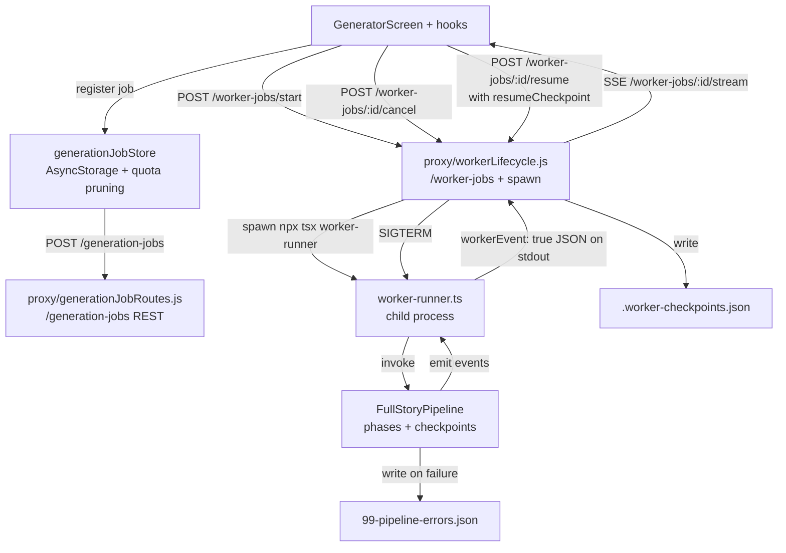

# Pipeline Orchestration

## Active Pipeline Paths

| Pipeline | File | Use Case |
|---|---|---|
| EpisodePipeline | `pipeline/EpisodePipeline.ts` | Single episode, sequential scenes |
| FullStoryPipeline | `pipeline/FullStoryPipeline.ts` | Multi-episode with all phases |

## Phase System (FullStoryPipeline)

Phases execute sequentially. Each declares prerequisites via `requirePhases()`.

```
Phase 1:   world_building              → WorldBuilder           → WorldBible
Phase 2:   character_design            → CharacterDesigner       → CharacterBible
           (optional) character_design_retry on low diversity
Phase 2.5: npc_validation              → NPCDepthValidator       (optional)
Phase 3:   episode_architecture        → StoryArchitect          → EpisodeBlueprint
Phase 3.5: branch_analysis             → BranchManager           → BranchAnalysis
Phase 4:   content_generation          → SceneWriter + ChoiceAuthor + EncounterArchitect
Phase 4.5: quick_validation            → IntegratedBestPracticesValidator (optional)
Phase 5:   qa                          → QARunner + Full Validation (parallel)
           (looped) qa_repair          → Karpathy-style targeted regeneration (up to N passes)
Phase 5.5: master_image_generation     → Character sheets + color scripts (cached)
           images                      → ImageAgentTeam (scene + encounter)
           (optional) video_generation → VideoDirectorAgent (when EXPO_PUBLIC_VIDEO_GENERATION_ENABLED)
Phase 6:   assembly                    → Compile final Story object
           (gate) asset_verification   → walkStoryAssets HTTP check (Tier 1 QA)
Phase 7:   saving                      → Write outputs to disk
           (optional) audio_generation → ElevenLabs narration after save
```

Evidence: every phase is wrapped in a `measurePhase()` call in `pipeline/FullStoryPipeline.ts`
(grep `measurePhase(` — the file is ~12k lines and typed, but don't trust hard-coded line numbers).
`asset_verification` is the `walkStoryAssets` gate; `qa_repair` is the Karpathy regeneration loop;
telemetry normalizes per-episode labels like `qa_ep_*` and `images_ep_*`. Find each by name, not line.

### Phase Dependency Enforcement

```typescript
requirePhases('content_generation', ['episode_architecture']);
// Throws if episode_architecture not in completedPhases
```

After execution: `markPhaseComplete('content_generation')`.

### Phase Timing

All phases wrapped in `measurePhase(phaseName, fn)` for telemetry.

## EpisodePipeline (Simplified)

```
Foundation → Content → Validation → Assembly → Saving
```

- No world/character building (assumes provided as input)
- Sequential scene processing (no dependency graph)
- Auto-fixes choice density if < 50% scenes have choices

## Concurrency Guidance

The authoritative architecture is now `FullStoryPipeline` plus focused concurrency utilities. Do not introduce or depend on a shadow `ParallelStoryPipeline` path.

## Checkpoint System

### CheckpointData

```typescript
interface CheckpointData {
  phase: string;
  data: unknown;
  timestamp: Date;
  requiresApproval: boolean;
}
```

### Checkpoint Phases and Approval

| Phase | requiresApproval |
|---|---|
| World Bible | true |
| Character Bible | true |
| Episode Blueprint | true |
| Branch Analysis | false |
| Scene Content | true |
| QA Report | true (if fails) |
| Best Practices Report | true (if fails) |
| Final Story | false |
| image_manifest | false |
| encounter_images | false |

### Creating Checkpoints

```typescript
this.addCheckpoint('Episode Blueprint', blueprintData, true);
```

Checkpoints saved to `09-checkpoints.json` in output directory.

### Resume Support

Worker-runner accepts `resumeCheckpoint`:
```typescript
resumeCheckpoint?: {
  steps?: Record<string, { status?: string }>;
  outputs?: Record<string, unknown>;
}
```

Phase checks before executing. Note: **resume `steps`/`outputs` are keyed by the OUTPUT artifact id (`world_bible`, `character_bible`, `episode_blueprint`, `scene_content`), not the phase name (`world_building`, `character_design`)**. See `getResumeOutput()` in `pipeline/FullStoryPipeline.ts` (grep the function name; line numbers drift):

```typescript
if (resumeCheckpoint?.steps?.world_bible?.status === 'completed') {
  // Skip phase, use cached output
  const cachedWorldBible = resumeCheckpoint.outputs.world_bible;
}
```

## Event System

### Emitting Events

```typescript
this.emit({
  type: 'phase_start',
  phase: 'content_generation',
  message: 'Generating scene content...',
  telemetry: { overallProgress: 0.4, phaseProgress: 0, currentItem: 1, totalItems: 8 }
});
```

### Event Types

| Type | When |
|---|---|
| `phase_start` / `phase_complete` | Phase boundaries |
| `agent_start` / `agent_complete` | Individual agent calls |
| `checkpoint` | Checkpoint created |
| `error` / `warning` / `debug` | Diagnostics |
| `incremental_validation` | Per-scene validation results |
| `validation_aggregated` | Full validation summary |
| `regeneration_triggered` | Content regeneration |

### Telemetry Fields

```typescript
interface PipelineProgressTelemetry {
  overallProgress: number;    // 0-1
  phaseProgress: number;      // 0-1 within current phase
  currentItem: number;
  totalItems: number;
  subphaseLabel?: string;
  etaSeconds?: number;
  elapsedSeconds?: number;
}
```

## Worker System (`server/worker-runner.ts`)

### Worker Modes

- `analysis`: Source material analysis + season planning
- `generation`: Full story generation pipeline

### Lifecycle

1. Receive payload via stdin/args
2. Start heartbeat interval (60s)
3. Execute pipeline (analysis or generation)
4. Forward pipeline events to parent via `emit('pipeline_event', {...})`
5. On completion: emit result, clear heartbeat, exit 0
6. On failure: emit error, clear heartbeat, exit 1

### Heartbeat

Emitted every 60 seconds:
```typescript
{ type: 'heartbeat', rssBytes, heapUsedBytes, heapTotalBytes }
```
Uses `setInterval` with `.unref()` to avoid blocking shutdown.

### Graceful Shutdown

`SIGTERM`/`SIGINT` handlers:
1. Emit `worker_error` with shutdown message
2. Clear heartbeat interval
3. Exit with code 130

### Event Forwarding

Worker wraps every emit with a top-level `workerEvent: true` marker so the proxy can distinguish worker output from its own logs. See `ai-agents/server/worker-runner.ts:11-13`:

```typescript
function emit(type: string, payload: Record<string, unknown> = {}) {
  console.log(JSON.stringify({ workerEvent: true, type, timestamp: new Date().toISOString(), ...payload }));
}
```

Pipeline events are re-emitted under `type: 'pipeline_event'` with the original event spread into the payload.

## Dependency Graph (`utils/dependencyGraph.ts`)

### Scene Dependencies

Built from `EpisodeBlueprint`:
- `scene.leadsTo` → navigation dependencies
- `scene.requires` → explicit prerequisite dependencies

### Topological Waves

```typescript
const waves: SceneWave[] = buildTopologicalWaves(blueprint);
for (const wave of waves) {
  await Promise.all(wave.sceneIds.map(id => processScene(id)));
}
```

Each wave contains scenes with no unresolved dependencies. Scenes within a wave execute in parallel; waves execute sequentially.

### Cycle Detection

`detectCycle(nodes)` checks for cycles. If found, parallel execution falls back to serial processing.

## Job Tracking (`utils/jobTracker.ts`)

### Job States

`'pending'` | `'running'` | `'completed'` | `'failed'` | `'cancelled'`

### Key Functions

- `registerJob(job)` → POST `/generation-jobs`
- `updateJob(jobId, updates)` → PATCH `/generation-jobs/:id`
- `isJobCancelled(jobId)` → GET `/generation-jobs/:id/status`
- `completeJob(jobId, outputDir?)` → marks complete
- `failJob(jobId, error)` → marks failed

### Cancellation Pattern

Pipeline calls `checkCancellation()` before each phase:
```typescript
if (await isJobCancelled(this.jobId)) {
  throw new JobCancelledError(this.jobId);
}
```

## Job Lifecycle Across Runtimes

The pipeline is only one leg of the generation flow. A generation job crosses three runtimes (Expo client, Express proxy, worker process) before its events come back to the UI. When an agent is debugging a job that "started but nothing happened" or "hung between phases," the issue is often in the HTTP or spawn layer rather than the pipeline itself.



Route ownership:

| Runtime | File | Routes / Responsibilities |
|---|---|---|
| Client UI | `GeneratorScreen` + hooks | Kick off, watch progress, request cancel/resume |
| Client store | `src/stores/generationJobStore.ts` | Local job list, AsyncStorage persistence with quota-aware pruning (strips bulk before save) |
| Proxy REST | `proxy/generationJobRoutes.js` | CRUD on `/generation-jobs`, status lookup |
| Proxy workers | `proxy/workerLifecycle.js` | `/worker-jobs/start`, `/worker-jobs/:id/stream` (SSE), `/cancel`, `/resume`, `/checkpoint`, `/failure-context`, `/timeline`, `/export`; owns `spawn()` + `.worker-checkpoints.json` |
| Worker | `src/ai-agents/server/worker-runner.ts` | Validates payload, runs analysis or generation, emits `workerEvent: true` JSON to stdout |
| Pipeline | `src/ai-agents/pipeline/FullStoryPipeline.ts` | Phases, checkpoints, event emission (see top of this file) |

Dual store reality: the client keeps a local job list; the proxy persists `generation-jobs` JSON and `.worker-checkpoints.json`. Hydration merges both. When jobs look out of sync, the source of truth is the proxy file.

## Checklist for Pipeline Changes

1. New phases must declare prerequisites via `requirePhases()`
2. Call `markPhaseComplete()` after successful execution
3. Wrap in `measurePhase()` for telemetry
4. Emit `phase_start`/`phase_complete` events with telemetry
5. Add checkpoint if phase produces reviewable output
6. Check cancellation before expensive operations
7. Update `completedPhases` tracking
8. If adding parallel execution, use `buildTopologicalWaves()` and handle cycles
