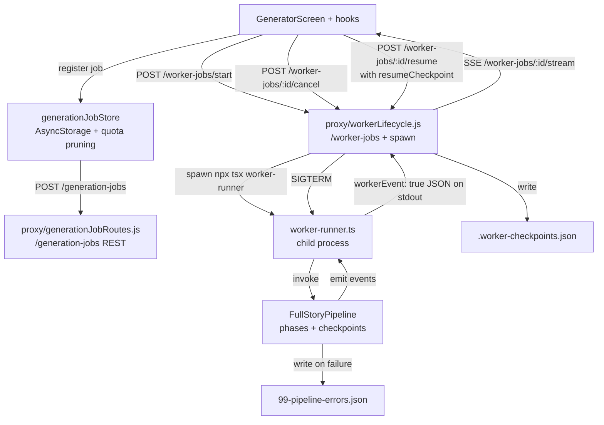

# Pipeline Orchestration

## Active Pipeline Paths

| Pipeline | File | Use Case |
|---|---|---|
| FullStoryPipeline | `pipeline/FullStoryPipeline.ts` | The only active text/story orchestration path: source analysis, season planning, per-episode authoring, validation, post-story media, assembly, and save/package output |

`EpisodePipeline.ts` and `ParallelStoryPipeline` have been removed. Do not add new work to a shadow
pipeline path. Parallelism lives inside `FullStoryPipeline`, extracted phases, dependency helpers,
provider throttles, and worker queues.

## Phase System (FullStoryPipeline)

`FullStoryPipeline` is still the driver, but much of its behavior has been extracted into typed phase
modules under `pipeline/phases/`. Continue that migration in behavior-preserving steps. Phases that
still use monolith wrappers are still the active path when the wrapper delegates to the phase.

```
RunArtifactPhase         → output directory, story id, checkpoints, episode completion writes
WorldBuildingPhase       → WorldBuilder → WorldBible
CharacterDesignPhase     → CharacterDesigner → CharacterBible
NPCDepthValidationPhase  → NPCDepthValidator retry/advisory handling
EpisodeArchitecturePhase → StoryArchitect → EpisodeBlueprint
BranchAnalysisPhase      → BranchManager + topology/advisory branch analysis
ContentGenerationPhase   → SceneWriter + ChoiceAuthor + EncounterArchitect + thread/twist/arc context
QuickValidationPhase     → fast best-practices validation + bounded targeted repairs
QAPhase                  → QARunner + full validation + QA repair loop
MasterImagePhase         → character reference sheets + location master shots
SceneImagePhase          → storyboard-v2 beat panels + image QA/repair/resume
EncounterImagePhase      → encounter setup/outcome/storylet visuals
CoverArtPhase            → poster/cover generation
VideoPhase               → optional beat video generation
AssemblyPhase            → runtime Story assembly, structural autofix, asset checks, final scans
AudioPhase               → optional TTS binding/generation
BrowserQAPhase           → optional Playwright multi-path QA and image remediation
SavingPhase              → story package, manifest, diagnostics, output writing
```

### Authored-lite structural collapse

When episode `treatmentGuidance.sourceKind === 'authored_lite'`, treat structure as:

**Parse+ESC → Facts → Realize → Enforce → Media**

| Stage | Owner | Must not |
|---|---|---|
| Parse+ESC | `compileEpisodeSpine` + `seasonScenePlanBuilder`; SeasonPlanner metadata overlay only | Invent/reorder scenes; `authorScenePlanLLM` |
| Facts | WorldBuilder / CharacterDesigner | Rewrite ESC order |
| Realize | StoryArchitect fill-slots; BranchManager skeleton; SceneWriter/ChoiceAuthor/EncounterArchitect | Invent topology; Thread/Twist/Arc LLMs (default off) |
| Enforce | EpisodeSpineContractValidator, plan-time fidelity, final contract prose/field repair | Final-contract structural invention (`blueprint_rebalance` / `episode_replan` → architecture/ESC rebuild) |
| Media | post-story image/video/audio | Run before text contract |

Debug skip events: `thread_twist_skipped_authored_lite`, `character_arc_skipped_authored_lite`,
`branch_annotation_skipped_authored_lite`. Force polish LLMs with
`STORYRPG_THREAD_TWIST_PLANNING=1`, `STORYRPG_CHARACTER_ARC_TRACKING=1`,
`STORYRPG_BRANCH_ANNOTATION=1`. Cognee stays advisory — index compiled ESC/ledger facts.

Story authoring completes before post-story media. Images/video/audio decorate authored story
artifacts; do not interleave media generation with story agents unless you are explicitly changing
that contract. Find phases by filename and event labels, not hard-coded line numbers.

### Phase Dependency Enforcement

```typescript
requirePhases('content_generation', ['episode_architecture']);
// Throws if episode_architecture not in completedPhases
```

After execution: `markPhaseComplete('content_generation')`.

### Phase Timing

All phases wrapped in `measurePhase(phaseName, fn)` for telemetry.

## Concurrency Guidance

The authoritative architecture is `FullStoryPipeline` plus focused concurrency utilities:

- `BaseAgent` controls LLM request concurrency and retry/circuit-breaker behavior.
- `providerThrottle.ts` and `providerCapabilities.ts` control image-provider RPM/concurrency.
- Image/audio phases use local queues and resume/dedup keys.
- Scene dependency helpers can build topological waves, but correctness and artifact contracts win
  over parallel speedups.

## Checkpoint System

### CheckpointData

```typescript
interface CheckpointData {
  phase: string;
  data: unknown;
  timestamp: Date;
  requiresApproval: boolean;
}
```

### Checkpoint Phases and Approval

| Phase | requiresApproval |
|---|---|
| World Bible | true |
| Character Bible | true |
| Episode Blueprint | true |
| Branch Analysis | false |
| Scene Content | true |
| QA Report | true (if fails) |
| Best Practices Report | true (if fails) |
| Final Story | false |
| image_manifest | false |
| encounter_images | false |

### Creating Checkpoints

```typescript
this.addCheckpoint('Episode Blueprint', blueprintData, true);
```

Worker checkpoints and output artifacts are persisted by `proxy/workerLifecycle.js` and the run
artifact/checkpoint stores. New generated packages write `story.json` plus `manifest.json`; legacy
watermarks exist for compatibility and diagnostics, not as the primary runtime load path.

### Resume Support

Worker-runner accepts `resumeCheckpoint`:
```typescript
resumeCheckpoint?: {
  steps?: Record<string, { status?: string }>;
  outputs?: Record<string, unknown>;
}
```

Phase checks before executing. Note: **resume `steps`/`outputs` are keyed by the OUTPUT artifact id (`world_bible`, `character_bible`, `episode_blueprint`, `scene_content`), not the phase name (`world_building`, `character_design`)**. See `getResumeOutput()` in `pipeline/FullStoryPipeline.ts` (grep the function name; line numbers drift):

```typescript
if (resumeCheckpoint?.steps?.world_bible?.status === 'completed') {
  // Skip phase, use cached output
  const cachedWorldBible = resumeCheckpoint.outputs.world_bible;
}
```

## Event System

### Emitting Events

```typescript
this.emit({
  type: 'phase_start',
  phase: 'content_generation',
  message: 'Generating scene content...',
  telemetry: { overallProgress: 0.4, phaseProgress: 0, currentItem: 1, totalItems: 8 }
});
```

### Event Types

| Type | When |
|---|---|
| `phase_start` / `phase_complete` | Phase boundaries |
| `agent_start` / `agent_complete` | Individual agent calls |
| `checkpoint` | Checkpoint created |
| `error` / `warning` / `debug` | Diagnostics |
| `incremental_validation` | Per-scene validation results |
| `validation_aggregated` | Full validation summary |
| `regeneration_triggered` | Content regeneration |

### Telemetry Fields

```typescript
interface PipelineProgressTelemetry {
  overallProgress: number;    // 0-1
  phaseProgress: number;      // 0-1 within current phase
  currentItem: number;
  totalItems: number;
  subphaseLabel?: string;
  etaSeconds?: number;
  elapsedSeconds?: number;
}
```

## Worker System (`src/ai-agents/server/worker-runner.ts`)

### Worker Modes

- `analysis`: Source material analysis + season planning
- `generation`: Full story generation pipeline

### Lifecycle

1. Receive payload via stdin/args
2. Start heartbeat interval (60s)
3. Execute pipeline (analysis or generation)
4. Forward pipeline events to parent via `emit('pipeline_event', {...})`
5. On completion: emit result, clear heartbeat, exit 0
6. On failure: emit error, clear heartbeat, exit 1

### Heartbeat

Emitted every 60 seconds:
```typescript
{ type: 'heartbeat', rssBytes, heapUsedBytes, heapTotalBytes }
```
Uses `setInterval` with `.unref()` to avoid blocking shutdown.

### Graceful Shutdown

`SIGTERM`/`SIGINT` handlers:
1. Emit `worker_error` with shutdown message
2. Clear heartbeat interval
3. Exit with code 130

### Event Forwarding

Worker wraps every emit with a top-level `workerEvent: true` marker so the proxy can distinguish worker output from its own logs. See `src/ai-agents/server/worker-runner.ts`:

```typescript
function emit(type: string, payload: Record<string, unknown> = {}) {
  console.log(JSON.stringify({ workerEvent: true, type, timestamp: new Date().toISOString(), ...payload }));
}
```

Pipeline events are re-emitted under `type: 'pipeline_event'` with the original event spread into the payload.

## Dependency Graph (`utils/dependencyGraph.ts`)

### Scene Dependencies

Built from `EpisodeBlueprint`:
- `scene.leadsTo` → navigation dependencies
- `scene.requires` → explicit prerequisite dependencies

### Topological Waves

```typescript
const waves: SceneWave[] = buildTopologicalWaves(blueprint);
for (const wave of waves) {
  await Promise.all(wave.sceneIds.map(id => processScene(id)));
}
```

Each wave contains scenes with no unresolved dependencies. Scenes within a wave execute in parallel; waves execute sequentially.

### Cycle Detection

`detectCycle(nodes)` checks for cycles. If found, parallel execution falls back to serial processing.

## Job Tracking (`utils/jobTracker.ts`)

### Job States

`'pending'` | `'running'` | `'completed'` | `'failed'` | `'cancelled'`

### Key Functions

- `registerJob(job)` → POST `/generation-jobs`
- `updateJob(jobId, updates)` → PATCH `/generation-jobs/:id`
- `isJobCancelled(jobId)` → GET `/generation-jobs/:id/status`
- `completeJob(jobId, outputDir?)` → marks complete
- `failJob(jobId, error)` → marks failed

### Cancellation Pattern

Pipeline calls `checkCancellation()` before each phase:
```typescript
if (await isJobCancelled(this.jobId)) {
  throw new JobCancelledError(this.jobId);
}
```

## Job Lifecycle Across Runtimes

The pipeline is only one leg of the generation flow. A generation job crosses three runtimes (Expo client, Express proxy, worker process) before its events come back to the UI. When an agent is debugging a job that "started but nothing happened" or "hung between phases," the issue is often in the HTTP or spawn layer rather than the pipeline itself.



Route ownership:

| Runtime | File | Routes / Responsibilities |
|---|---|---|
| Client UI | `GeneratorScreen` + hooks | Kick off, watch progress, request cancel/resume |
| Client store | `src/stores/generationJobStore.ts` | Local job list, AsyncStorage persistence with quota-aware pruning (strips bulk before save) |
| Proxy REST | `proxy/generationJobRoutes.js` | CRUD on `/generation-jobs`, status lookup |
| Proxy workers | `proxy/workerLifecycle.js` | `/worker-jobs/start`, `/worker-jobs/:id/stream` (SSE), `/cancel`, `/resume`, `/checkpoint`, `/failure-context`, `/timeline`, `/export`; owns `spawn()` + `.worker-checkpoints.json` |
| Worker | `src/ai-agents/server/worker-runner.ts` | Validates payload, runs analysis or generation, emits `workerEvent: true` JSON to stdout |
| Pipeline | `src/ai-agents/pipeline/FullStoryPipeline.ts` | Phases, checkpoints, event emission (see top of this file) |

Dual store reality: the client keeps a local job list; the proxy persists `generation-jobs` JSON and `.worker-checkpoints.json`. Hydration merges both. When jobs look out of sync, the source of truth is the proxy file.

## Checklist for Pipeline Changes

1. Prefer a typed phase or helper extraction over growing `FullStoryPipeline`.
2. Preserve event names, checkpoint keys, prompt snapshots, and artifact ids during extraction.
3. Emit `phase_start`/`phase_complete` events with telemetry for user-visible work.
4. Add checkpoint/artifact writes when the phase produces resumable or reviewable output.
5. Check cancellation before expensive operations and before starting provider calls.
6. Keep generated package output centered on `story.json` + `manifest.json`.
7. If adding parallel execution, use the existing dependency/throttle utilities and handle cycles.
8. Run focused prompt-snapshot/phase tests plus `npm run typecheck` for orchestration changes.
